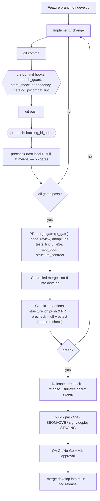
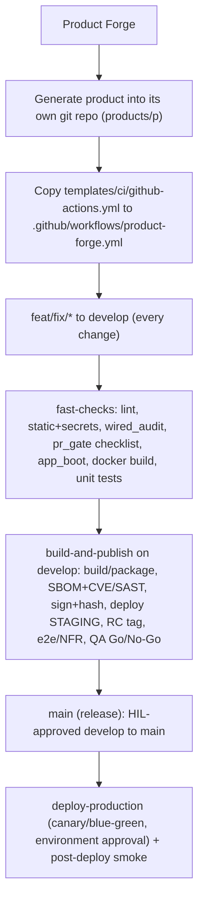

# CI/CD & Gates — Product Forge (SSOT)

**Single source of truth for how Product Forge builds, verifies, and ships — for PF itself and for every
generated product.** Companion/router to the detailed docs (this page is the authority for the *map*; the
linked docs own the *detail*). Owner: `core/vcs.py` (git), `scripts/dev/precheck.py` (gates),
`.github/workflows/structure.yml` (CI), `core/pr_gate.py` (merge gate).

Related docs (detail, not duplicated here):
`docs/BRANCHING-GIT-WORKFLOW.md` · `docs/ENGINEERING_OPERATING_STANDARD.md` (EOS) · `docs/REVIEW-MODEL.md` ·
`docs/PR-WORKFLOW.md` · `docs/ENG-5-GITHUB-PR-CI.md` · `docs/ENG-6-COMMON-VALIDATION-ENGINE.md` ·
`docs/ENG-7-FEATURE-PR.md` · `docs/ENG-8-INTEGRATION.md` · `docs/ENG-9-DOGFOOD.md` · `docs/ENG-10-RELEASE.md` ·
`docs/TESTING-REFERENCE.md`. Machine model: `config/engineering-flow.json`,
`config/validation-profiles.json`, `config/test-matrix.json`, `pipeline-definition.json`.

> **Authority order:** the **code** wins (`core/`, `config/*.json`, `pipeline-definition.json`,
> `.github/workflows/*`). If this doc disagrees with code, code wins — open a backlog item to reconcile.

---

## End-to-end workflow (diagrams)

### Diagram 0 — plain text (renders anywhere: terminal, any viewer, docs index)

```text
SPINE: a change -> gates -> merge -> CI -> release
==============================================================================================

  LOCAL (author)
  ┌────────────────────────────────────────────────────────────────────────────────────────┐
  │ feature branch off develop                                                              │
  │        |                                                                                │
  │        v                                                                                │
  │   implement / change  ──►  git commit  ──►  [ pre-commit hooks ]                        │
  │                                              ├ branch_guard      (no direct dev/main)   │
  │                                              ├ store_check       (registered stores)     │
  │                                              ├ dependency-catalog(new dep allowlisted)  │
  │                                              ├ pycompat          (py3.11 f-string)       │
  │                                              └ lint --strict     (changed files)         │
  │                                                     | ok                                 │
  │                                                     v                                    │
  │                                             git push ──► [ pre-push: backlog_id_audit ]  │
  └──────────────────────────────────────────────────┬─────────────────────────────────────┘
                                                     v
  MERGE-TIME (precheck + PR merge gate)
  ┌────────────────────────────────────────────────────────────────────────────────────────┐
  │  python scripts/dev/precheck.py [--full]   ──►   PR merge gate (core/pr_gate.py)        │
  │    55 gates: compile, pycompat, wired-audit,     code_review, review_changes_done,      │
  │    store-contract, lint, secret-scan, api-       db_tests, api_tests, unit_tests,       │
  │    contract/governance, backlog-*, docs-fresh…   lint, ui_e2e, app_boot, structure_contract
  │                       |                                    (unknown = does NOT pass)     │
  │                       | fail ────────────────────────────► back to implement            │
  │                       v pass (controlled merge --no-ff)                                  │
  └──────────────────────────────────────────────────┬─────────────────────────────────────┘
                                                     v  develop
  CI (GitHub Actions: .github/workflows/structure.yml)
  ┌────────────────────────────────────────────────────────────────────────────────────────┐
  │  on: push [main, develop]  AND  every pull_request                                      │
  │  job "structure" (ubuntu, Python 3.11):  precheck --full   +   pytest test-framework    │
  │  => REQUIRED status check (branch protection)                                           │
  └──────────────────────────────────────────────────┬─────────────────────────────────────┘
                                                     v
  RELEASE
  ┌────────────────────────────────────────────────────────────────────────────────────────┐
  │  precheck --release (+ full-tree secret sweep) ► build ► package ► SBOM+CVE/SAST ►      │
  │  sign+hash ► deploy STAGING ► QA Go/No-Go ► HIL approval ► merge develop->main + tag    │
  └────────────────────────────────────────────────────────────────────────────────────────┘

PRODUCT-BUILDING PIPELINE (stages; [..] = blocking gate)
==============================================================================================
  0 Ideation
    -> 0a Discovery -> 1 Design -> 1a Product Design Spec -> 1b Design Review -> 2 Architect
    -> [3a QA Spec Review]  -> 4-0 Skeleton
    -> 4a..4f Iterations:  implement-db/api/logic/ui -> devops -> code-review -> fix -> validate
                           [per-iteration gate]
    -> [5 Security Scan] -> 6 NFR -> 7 Full Test Suite -> 8 Document -> 9 Package
    -> 10 Pre-Production -> [10a QA Go/No-Go] -> 11 Deploy -> 12 Exit -> (13 Operate/Grow optional)

GENERATED PRODUCT = its own repo + its own CI (template)
==============================================================================================
  Product Forge -> generate -> products/<p>/ (own git repo)
        |-- copy templates/ci/github-actions.yml -> .github/workflows/product-forge.yml
        v
  feat/fix/*  ->  develop:  fast-checks  ->  build-and-publish  ->  main  ->  deploy-production
                 (lint/static/secrets/wired_audit/       (build/package/SBOM+CVE/     (HIL env
                  pr_gate checklist/app_boot/tests)        sign/deploy staging/       approval)
                                                           RC tag/e2e/NFR/QA Go-No-Go)
```

### Diagram 1 — A change → gates → merge → CI → release (the git/CI-CD spine)


### Diagram 2 — The product-building pipeline (stages & per-stage gates)

```mermaid
flowchart LR
  S0["0 Ideation"] --> S0a["0a Discovery"] --> S1["1 Design"] --> S1a["1a Product Design Spec"] --> S1b["1b Design Review"] --> S2["2 Architect"]
  S2 --> S3a["3a QA Spec Review (gate)"]
  S3a --> S40["4-0 Skeleton"]
  S40 --> S4["4a-4f Implementation iterations: implement-db/api/logic/ui to devops to code-review to fix to validate (per-iteration gate)"]
  S4 --> S5["5 Security Scan (gate)"]
  S5 --> S6["6 NFR Tests"] --> S7["7 Full Test Suite"] --> S8["8 Document"] --> S9["9 Package"] --> S10["10 Pre-Production"] --> S10a["10a QA Go/No-Go (gate)"] --> S11["11 Deploy"] --> S12["12 Exit"]
  S12 -.optional.-> S13["13 Operate / Grow / Engage"]
```


### Diagram 3 — Generated product = its own repo + its own CI (template)


---

## 0. Model in one line
`feature branch → (author-time checks) → commit → push → (merge-time precheck) → PR merge gate → controlled
merge to develop → CI (same precheck, full tier) → release tier`. PF and every generated product follow the
**same** flow; only the repo/scope differs.

Branch model (both PF and generated products):
`feat/*`, `fix/*` → **develop** (integration; every change) → **main/release** (release: green + QA GO + HIL).

---

## 1. Part A — Product Forge CI/CD

### 1.1 Trigger map (when / who / how)
| # | Stage | Triggered by | Who runs it (owner) | Blocking |
|---|---|---|---|---|
| A1 | Author-time hooks | `git commit` / `git push` | `scripts/dev/install_hooks.py` → `.git/hooks/*` | yes (local) |
| A2 | Merge-time precheck | human or `core/vcs.py` before merge | `scripts/dev/precheck.py` | yes |
| A3 | PR merge gate | CI + `core/pr_gate.can_merge` | `core/pr_gate.py` | yes (fail-closed) |
| A4 | Delivery (pipeline) | worker/agent `deliver()` | `core/delivery.py` + `core/vcs.merge` | yes |
| A5 | CI | GitHub Actions on **push** + **pull_request** | `.github/workflows/structure.yml` | yes (required check) |
| A6 | Release | explicit / periodic | `precheck.py --release` | yes |

### 1.2 A1 — Author-time hooks (`install_hooks.py`)
| Hook | Checks | Owner scripts |
|---|---|---|
| **pre-commit** | branch guard (no direct commit to develop/main) · store-contract · dependency-catalog · **pycompat** (changed `.py`, py3.11 CI target) · lint `--strict` (changed files) | `branch_guard.py`, `store_check.py`, `dependency_catalog_check.py`, `pycompat_check.py`, `lint_check.py` |
| **pre-push** | backlog id uniqueness (`backlog_id_audit.py`); registers the `merge.pf-derived` **merge driver** (regenerates `backlog/{open,closed}.json` from `items/`) | `backlog_id_audit.py`, `pf_merge_driver.py` |

Install/refresh: `python scripts/dev/install_hooks.py` (run once per clone). Emergency direct-commit override:
`PF_ALLOW_DIRECT_COMMIT=1` (owner-only; audited).

### 1.3 A2/A5 — `precheck.py` tiers (the merge/CI gate)
| Tier | Invoked | Scope | Typical use |
|---|---|---|---|
| **fast** (default) | `python scripts/dev/precheck.py` | core gates + area gates + scoped tests (~1 min) | per-change, locally |
| **deep** (`--full`) | `python scripts/dev/precheck.py --full` | + validation/lifecycle + full pytest suite | **CI + merge** |
| **release** (`--release`) | `python scripts/dev/precheck.py --release` | + periodic full-tree sweeps (`secret_scan --all`) | before a release |

Representative gate groups (all in `precheck.py::_GATES`): `compile`, **`pycompat`**, `wired-audit`,
`store-contract`, `lint`, `secret-scan`, `api-contract`/`api-governance`, `engineering-flow`,
`task-contract`, `scheduler`, `lease`, `vcs-worktree`, `worker`, `reservations`, `packaging`, `tool-catalog`,
`dependency-catalog`, `backlog-reconcile`/`-context`/`-ids`, `grooming`, `github`, `pf-surface`, `wg-surface`,
`pidl*`, `intent-trace`, `docs-fresh`, `review-static`, `compliance-register`, and deep-tier
`validation-engine`, `feature-pr`, `merge-gate`, `dogfood*`, `release`, `final-audit`, `backlog-e2e`.

### 1.4 A3 — PR merge gate (`core/pr_gate.py`)
Every merge requires a PR whose checklist passes. **Items that cannot be proven are `unknown` and DO NOT pass:**
`code_review · review_changes_done · db_tests · api_tests · unit_tests · lint · ui_e2e · app_boot ·
structure_contract`.
Override is **HIL-only** (`qa.override_merge`), recorded + audited. (PF's own PRs: the same checklist is
surfaced by the `structure` CI job + branch protection.)

### 1.5 A4 — Delivery lane (pipeline / workers)
`core/delivery.py` lands ONE item: GitHub PR-merge (preferred) or a throwaway `integrate/*` worktree off
`origin/<integration>`, then `run_quality_gate` → push `HEAD:<integration>`. Fail-closed: any conflict/red gate
⇒ `blocked`, never merge. The live tree's branch is never switched. Owner: `core/delivery.py`, `core/vcs.py`.

### 1.6 A5 — CI (`structure.yml`)
`on: push [main, develop] + pull_request`. Job **`structure`** (ubuntu, **Python 3.11**):
```
checkout (fetch-depth 0) → setup-python 3.11 → git identity → install dev deps
 → python scripts/dev/precheck.py --full      # REQUIRED (fatal)
 → python -m pytest test-framework/tests -q   # informational (continue-on-error; some tests need libs)
```
Make the `structure` job a **required status check** + "no force-push" via branch protection (repo setting).

### 1.7 A6 — Release
`precheck.py --release` (adds the full-tree secret sweep). Release gate = `core/release.py` + `qa_report`
Go/No-Go; packaging/SBOM/deploy in `core/packaging.py` / `core/deploy_providers.py`
(see `docs/ENG-10-RELEASE.md`, `docs/REL-0-PACKAGING.md`).

---

## 2. Part B — Gates/tests run *with* local work at pipeline stages (not just CI)

Two families: **(B1) non-LLM mechanical gates** and **(B2) pipeline stage gates** (agent + gate).

### 2.1 B1 — Mechanical gates (called during work / precheck)
| Gate | When | Owner | Blocking |
|---|---|---|---|
| `spec_review` (E6/E7) | stage 3a, pre-implementation | `core/spec_review.py` | yes |
| `review_static_check` | changed files | `scripts/dev/review_static_check.py` | advisory→fatal |
| `lint` (ruff) | changed files | `scripts/dev/lint_check.py` | advisory→fatal |
| `secret_scan` | changed files (+ `--release` full) | `scripts/dev/secret_scan.py` | yes |
| `dependency_catalog_check` | new dependency | `scripts/dev/dependency_catalog_check.py` | yes |
| `traceability_check` (E8) | per project | `core/traceability.py` | yes |
| `api_governance` / `api_contract` | repo | `scripts/dev/api_governance_check.py` | yes |
| `intent_trace_check` | repo | `scripts/dev/intent_trace_check.py` | advisory |
| `compliance_register_check` | repo | `scripts/dev/compliance_register_check.py` | yes |

### 2.2 B2 — Pipeline stage gates (per run)
| Stage (pipeline-definition.json) | Gate / agent | Owner | Blocks |
|---|---|---|---|
| 3a QA Spec Review | spec/design gate | `validate` + `core/spec_review.py` | yes |
| 4a–4f Implementation (per iteration) | `code-review` (LLM) → `fix` → `validate` | `core/cross_review.py`, `run_quality_gate.py` | yes |
| 5 Security Scan | `security` agent | `agents/security.agent.json` | yes |
| 6/7 NFR + Full Test Suite | `validate` + test framework | `test-framework/` | yes |
| 10a Go/No-Go | `qa_report.go_no_go` | `core/qa_report.py` | yes |
| close/loop | close-loop gate + `validation_engine` profiles | `core/close_loop.py`, `core/validation_engine.py` | yes |

**Validation profiles** (`config/validation-profiles.json`, ENG-6): `FEATURE_PR` (pre-merge, default),
`INTEGRATION`, `DOGFOOD`, `RELEASE` — each selects checks (`target, quality_gate, tests, policy, verification,
pr_gate` + extras) and a promotion. Owner: `core/validation_engine.py`.

**Review model:** reviews run **per build iteration** — LLM `code-review` (`docs/REVIEW-FOCUS.md`) +
non-LLM gates + the fail-closed PR merge gate (`docs/REVIEW-MODEL.md`).

---

## 3. Part C — Generated products: do they have their own CI/CD?

**Yes — by default, template-driven; customizable per product via its requirements/capabilities.**

| aspect | how |
|---|---|
| Own repo | each product is its **own** git repo (`products/<project>/`, git-init'd by `core/vcs.py`) |
| Branch model | `feat/*`, `fix/*` → **develop** → **main/release** (identical to PF) |
| CI template | `templates/ci/github-actions.yml` → copied to the product's `.github/workflows/product-forge.yml`; `templates/ci/gitlab-ci.yml` for GitLab |
| Template CI jobs | `fast-checks` (lint, static+secrets, `wired_audit`, **PR merge checklist** via `core.pr_gate.can_merge`, app-boot, docker build, unit tests) · `build-and-publish` (build/version, package, SBOM+CVE/SAST, sign+hash, deploy STAGING, RC tag, e2e/NFR, **QA Go/No-Go**) · `deploy-production` (main only; **HIL environment approval**) |
| PF-side enforcement | the **same** `core/vcs.py` (branch/worktree/merge), `core/delivery.py`, `core/pr_gate.py`, validation profiles, and per-iteration review apply to `project` scope |
| Customization | per-product profile from its **requirements/capabilities** (e.g. modality packs, security profile C13) selects extra checks; defaults apply when unspecified |

**Is it known in advance?** The **shape** is default (the templates + the PF gate flow). The **per-product
specifics** (extra scanners, deploy targets, compliance add-ons) come from the product's requirements +
capability packs + derived security profile (C13). So: default pipeline by construction, refined per product.

---

## 4. Part D — Where these details are stored & viewed (API/UI)

**Today (machine-readable owners):**
| concern | store / config | owner |
|---|---|---|
| engineering flow (requirement→deploy) | `config/engineering-flow.json` | `core/engineering_flow.py` |
| validation profiles | `config/validation-profiles.json` | `core/validation_engine.py` |
| test categories | `config/test-matrix.json` | `core/test_matrix.py` |
| pipeline stages/agents | `pipeline-definition.json` | `core/pipeline_executor.py` |
| PR / CI evidence | `pr-records.json`, `validation-runs.json`, `release-evidence.jsonl` | `core/github.py`, `core/validation_engine.py`, `core/release.py` |
| gates (this page) | this doc + `scripts/dev/precheck.py` | `precheck.py`, `pr_gate.py` |

**Gap (proposed):** there is no single read API that projects CI/CD + gates for the orchestrator/UI.
Proposed (needs approval — **new concern → register a single writer**):
- `GET /api/v1/engineering/ci-cd` — the model (tiers × gates × triggers × owners, from the configs above).
- `GET /api/v1/engineering/gates` — gate catalog + last run verdict/evidence.
- `GET /api/v1/engineering/ci-cd/{scope}` — per-scope (`product_forge` | `project:<id>`) effective pipeline.
Owner: a new `core/ci_cd_model.py` (reads existing owners; **never** a second truth) + `api/routers/engineering.py`.
Tracked by a backlog item (see §6).

---

## 5. Maintenance
- This doc is registered in `scripts/dev/gen_docs_index.py` (`TOP`, status **SSOT**); CI's `docs-fresh` gate
  fails if it is unclassified or the index is stale → regenerate with
  `python scripts/dev/gen_docs_index.py` after edits.
- Any change to a gate/trigger updates **this doc** and the owning code in the same change
  (see `docs/ADDING-TO-PRODUCT-FORGE.md`).

## 6. Backlog
- **CI/CD model + read API for orchestrator/UI** (Part D) — to be recorded as a backlog item
  (owner: new `core/ci_cd_model.py`; API on `api/routers/engineering.py`).
- **CI health** epic BI-PF-1228 (deps/id-authority/cross-platform/generated-artifacts) — landed.
