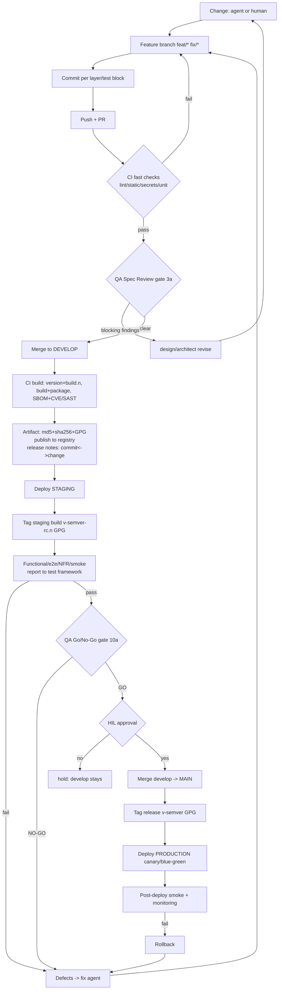

# Git Workflow + CI/CD Orchestration (Product Forge)

> End-to-end spec for version control, branching/tagging, CI/CD, artifact provenance,
> and staged deployment — integrated with the QA/Quality system and Go/No-Go gates.

---

## 1. Repo & ownership
- **Repo provider = the user/org** (GitHub / GitLab / Azure DevOps / Bitbucket / self-hosted).
  Product Forge never owns the remote. If none is supplied it can `git init` a **local** repo per product.
- Config: `project.json → vcs { provider, remote, branch_model, protected, sign_tags, commit_convention }`.
- The **orchestrator's VCS manager** (`core/vcs.py`) performs all git operations on behalf of agents.
  Agents only read/write files; they never run git directly.

## 2. Universal branching rule
- **Every change (agent or human) happens on a short-lived feature branch.** `main` and `develop` are protected.
- Branch names: `<type>/<ref>-<slug>` — `feat/F-3-login`, `fix/DEF-0012-null-deref`,
  `chore/build-0.2.0-b7`, `test/NFR-2-latency`.
- **Model:** `feat/fix/* → develop` (all changes merge to `develop`), and
  `develop → main` **only** when tests/CI are green, **QA Go/No-Go = GO**, and **HIL approves**.
  `main` holds released/stable code only.
- Merge via PR that passes CI + review (+ our gates).

## 3. Who commits / what is committed
- Agents produce files → **VCS manager** stages + commits with a conventional message referencing
  the unit (`feat(F-3): …`, `fix(DEF-0012): …`) and pushes the feature branch.
- Committed: **product code, tests, migrations, docs, release notes, version manifests**.
- **Not** committed: run logs, secrets, credentials, large binaries (→ artifact store / `products/<p>/.pipeline`).

## 4. Check-in cadence / intervals
| Event | Commit/Push |
|---|---|
| Per implemented layer (db/api/logic/ui) | commit |
| Per test block added | commit |
| Per iteration (implement→build→validate) | push branch |
| Per fix cycle | push branch |
| Idle > N minutes (unattended) | WIP snapshot commit |
| Per build | tag candidate |

## 5. Versioning & tagging
| Event | Version effect | Tag |
|---|---|---|
| Every CI build (merge to `develop`, or fix cycle) | `build.<n>` +1 (`v0.3.0+build.7`) | *(build metadata only — no tag)* |
| Feature set / epic completed (per iteration) | **MINOR** +1 → `0.4.0` | — |
| Fix-only build | **PATCH** +1 → `0.3.1` | — |
| Breaking change | **MAJOR** +1 → `1.0.0` | — |
| **Staging deploy** (most stable build) | freeze current | `v<semver>-rc.<n>` (**GPG-signed**) |
| **Release** (`develop→main`, HIL approved) | freeze `v<semver>` | `v<semver>` (**GPG-signed**) |

**Tagging policy: only the staging (RC) and release builds are tagged — not every build.**
This keeps tags meaningful (stable points), and `build.<n>` stays as metadata on `build-info.json`,
the artifact name, and release notes.

- Version/number from `core/build_manager`; format `v<semver>+build.<n>`.
- **No per-feature tags** — features are tracked via PRs/commits referencing `F-<id>`/`FR-<id>`
  and enumerated in release notes. Only **RC/release** tags are cut.
- Release notes: `docs/releases/<build_id>.md` + `CHANGELOG.md`, each entry mapping a
  **git commit hash ↔ change** (feature / defect fixed / spec finding resolved), with artifact
  **md5/sha256 + GPG signature**.
- **GPG**: sign RC/release tags and artifact checksums (key from org secret / HIL).

## 6. Conflicts & stash
- **Conflicts:** branch owner (agent owning that layer) rebases and resolves pre-PR; semantic/architectural
  → `architect`; human-owned or unresolvable → **HIL**. Orchestrator auto-rebases; merge is blocked on conflict.
- **Stash:** avoided by design (agents commit). If a dirty tree must switch branches:
  `git stash push -m "<run-id>"` then immediate restore; stashes are ephemeral, never used for handoff.
- Concurrent agent runs use separate branches; `LockManager` serializes shared-resource writes.

## 7. CI/CD pipeline
**Trigger A — push to feature branch (fast):** checkout → lint/format → static analysis → secrets scan →
unit tests → PR checks.
**Trigger B — merge to `main` (build):**
1. version bump (`build_manager`) → 2. build/package → 3. SBOM (syft) →
4. SAST/deps/CVE (bandit/semgrep/trivy/snyk) → 5. **artifact + md5sum + sha256 (+ signature/cosign/GPG)** →
6. publish to **artifact registry** → 7. release notes (commit↔change) → 8. deploy **staging**.

**Policy gates (QA system):** `3a QA Spec Review` before implementation; `10a QA Go/No-Go` before deploy.

## 8. Artifact provenance
- Content-addressed, immutable; **md5sum + sha256** recorded; optional **digital signature**.
- `build-info.json` + release notes list: `build_id`, commit, artifacts, checksums, signature, features/defects.
- Backends: local (default) / OCI registry / S3-GCS-Azure / Artifactory-Nexus (`core/artifact_registry`).

## 9. Deployment orchestration
1. **Config** resolved per env from `project.json → deploy` + `docs/infra.json` (+ secret refs; never in repo).
2. **Staging first (always):** deploy → install/configure → run.
3. **Functional/e2e/NFR/smoke** executed → results + defects reported to the **test framework**.
4. Failures → `fix` agent → new branch → CI build → redeploy (**loop**).
5. **Production** behind **HIL approval**; strategy canary/blue-green; post-deploy smoke; rollback on failure.
- Providers: `docker / local / kubernetes / helm / terraform / ansible / <cloud>` (`core/deploy_providers`).
- **Who provides target/config:** user/org or vendor (real infra); pipeline defaults for docker/local;
  vendor labs via adapters.

## 10. Multiple people + many agents
- One branch per change; rebase-before-PR; PR review; **CODEOWNERS** (e.g., security paths → security agent/human).
- Agents never commit to `main` directly; humans follow the same rule.
- Orchestrator serializes commits within a run; concurrent runs use separate branches + locks.

## 11. Component map
| Concern | Component |
|---|---|
| Branch/commit/push/tag/rebase/stash | `core/vcs.py` (NEW) |
| Version/build number/release notes | `core/build_manager.py` |
| Lint/static/secrets/unit | CI + `core/verification_runner`, `core/nfr_runner` |
| SBOM/CVE/SAST | `core/nfr_runner` (syft/trivy/snyk/bandit) |
| Artifact + checksums + signature + registry | `core/artifact_registry.py` |
| Deploy staging/prod + config | `core/deploy_providers.py` |
| Test execution/results/defects/fix loop | `core/test_framework_integration.py`, `core/defect_loop.py` |
| Gates + Go/No-Go | stages `3a`, `10a`, `core/qa_report.py` |

## 12. Who orchestrates git (automatic vs agent)
- **The orchestrator's VCS manager (`core/vcs.py`) owns all git operations — automatically.**
  Individual agents do **not** run git; they only read/write files. The manager creates branches,
  commits, pushes, rebases, tags, and handles stash on their behalf.
- **Check-in is automatic** at logical points (per layer, per test block, per iteration, per fix cycle).
- **WIP snapshot (safety net):** if a run is unattended and idle, a `wip(...)` commit is made to the
  **feature branch** (never `develop`/`main`); it captures mid-flight partial state safely and is
  **squashed on PR**. Default fallback **30 minutes**; disable with `--no-wip`.

## 13. Wired trigger points (in the pipeline)
| Trigger | Location | Action |
|---|---|---|
| Stage start (`4-0`, `4a..4f`) | `stage_runner._execute_stage_sequential` | `_vcs_stage_branch` → create feature branch |
| Stage end | `stage_runner._execute_stage_sequential` | `_vcs_stage_finalize` (commit→push→merge to `develop`) + `_vcs_wip` snapshot |
| Staging deploy done | `stage_runner` post-deploy hook | `_vcs_rc_tag` → `v<semver>-rc.<n>` (GPG) |
| Stage `10a` QA gate | `stage_runner` → `_vcs_release` | `develop→main` + `v<semver>` **only if GO + HIL** |

`develop → main` **requires HIL** approval (auto mode = pre-approved; or `PIPELINE_RELEASE_APPROVED=1`).

## 14. Confirmed decisions
1. Idle WIP interval default = **30 min** (event-based commits are primary).
2. Signing = **GPG**, with **both** key sources supported: org secret (`GPG_PRIVATE_KEY`/`GPG_KEY_ID`) **or** HIL-provided (`project.json → signing.key_id|key_file`).
3. **`develop → main` requires HIL only — no separate human PR approval.**
4. Vendors/labs handled as **data + adapters + user/vendor labs** (`core/vendor_adapters.py`); their verification policy is **external** when no lab is detected.

## 15. E2E workflow diagram



**ASCII (compact):**
```
 change -> feat/* -> commit/push -> PR -> CI(lint/static/secrets/unit)
      -> [3a QA Spec Review] -> verify green
      -> merge DEVELOP -> build(version+build.n, SBOM, CVE)
      -> artifact(md5+sha256+GPG) + release-notes(commit<->change)
      -> deploy STAGING -> TAG rc (v_semver-rc.n) -> tests/NFR
            fail -> defects -> fix -> feat/* (loop)
            pass -> [10a QA Go/No-Go]
                 NO-GO -> fix loop
                 GO -> HIL approval? -- yes --> merge MAIN -> TAG release (v_semver)
                                                      -> deploy PROD -> smoke/monitor
```

## 16. PR merge checklist + HIL override
Every merge to `develop` (and `develop → main`) needs a PR whose **checklist passes**
(`core/pr_gate.py`, enforced by `vcs.merge` and the CI PR job):

| Item | Meaning | Signal |
|---|---|---|
| `code_review` | reviewer (`code-review`) approved | audit-trail completion |
| `review_changes_done` | requested review changes resolved | no blocking review findings |
| `db_tests` | DB-layer unit tests exist & pass | `tests/db/*` + latest cycle passed |
| `api_tests` | API-layer unit tests exist & pass | `tests/api/*` + latest cycle passed |
| `unit_tests` | unit suite passes | latest cycle passed |
| `lint` | lint/static clean | no failures + build exists |
| `ui_e2e` | minimal UI/E2E for the change passes | e2e/bdd run passed (UI products only) |

- Items that can't be **proven** are `unknown` → **do not pass** (merge blocked).
- **Override is HIL-only**: `core/pr_gate.request_override()` records a request (pending);
  `approve_override()` (HIL) sets `approved=true` → `can_merge` allows the merge. Recorded + audited.
- CI: the PR job runs the gate; blocked merges fail the job.

## 17. Check-ins / PR history API
- `core/vcs.checkins(limit)` → `[{sha, author, date, brief, pr, merge}]` from git history
  (PR# parsed from message/body, e.g. `feat(F-1): login (#12)`).
- Test framework API: **`GET /api/checkins?project=<p>&limit=`** and
  **`GET /api/pr-gate?project=<p>`** (merge checklist status). Console has a **Check-ins** tab.
- UI-agnostic: any dashboard can consume these endpoints.
