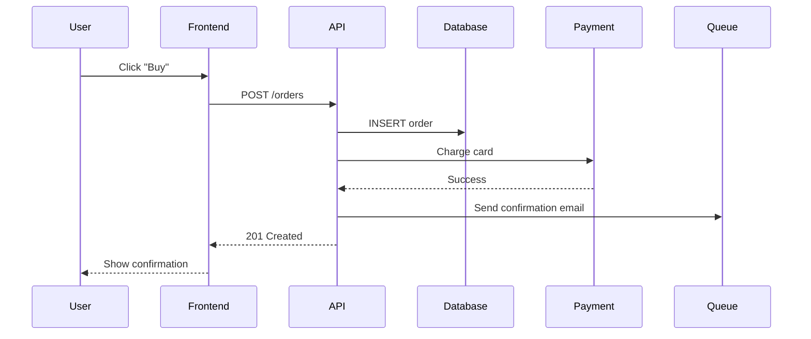
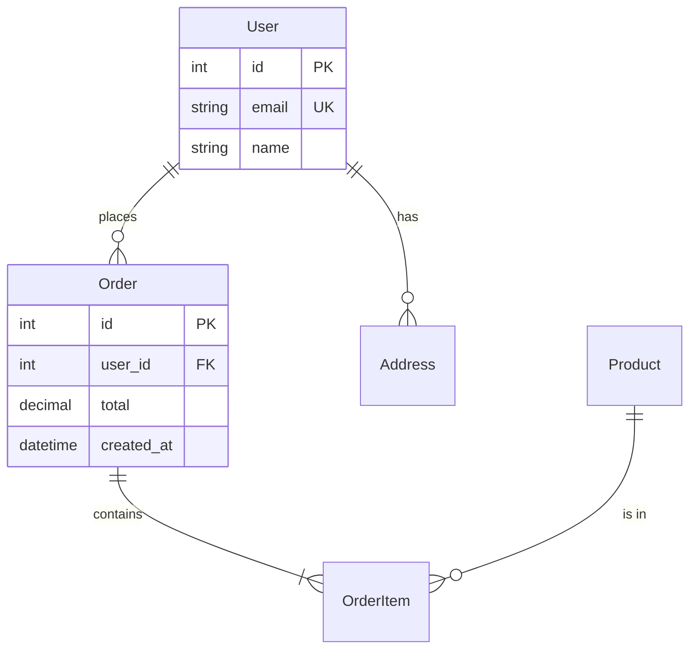
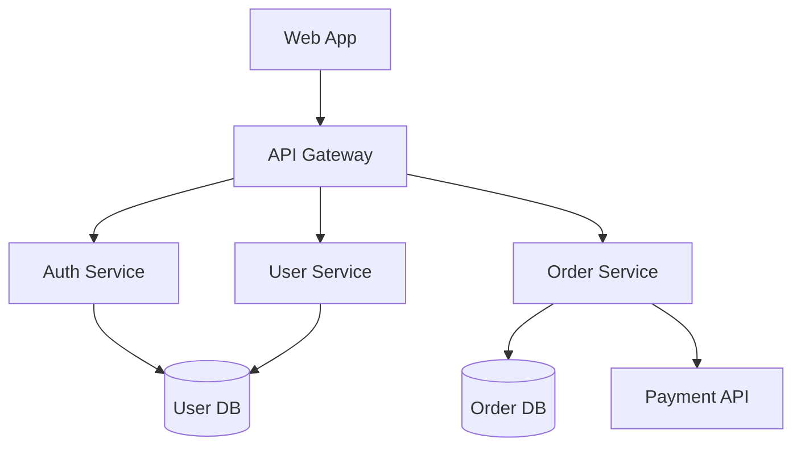

# Architecture Engineering Standards

> Architecture Decision Records (ADRs), system design, and technical decision-making for MyWorld Central Portal.

## Table of Contents

1. [Architecture Decision Records (ADRs)](#architecture-decision-records-adrs)
2. [System Design Documentation](#system-design-documentation)
3. [Component Design](#component-design)
4. [API Design at Architecture Level](#api-design-at-architecture-level)
5. [Data Architecture](#data-architecture)
6. [Integration Patterns](#integration-patterns)
7. [Non-Functional Requirements](#non-functional-requirements)
8. [Architecture Review Process](#architecture-review-process)
9. [Diagrams as Code](#diagrams-as-code)
10. [Decision-Making Framework](#decision-making-framework)

---

## Architecture Decision Records (ADRs)

### What is an ADR?

An **Architecture Decision Record** captures a significant architectural decision:
- **Context** — What is the situation?
- **Decision** — What did we decide?
- **Consequences** — What are the trade-offs?

ADRs are immutable once accepted. Create a new ADR to supersede an old one.

### When to Write an ADR

✅ **Write an ADR for:**
- Choosing a technology stack (framework, database, language)
- Defining a system boundary (microservice vs monolith)
- Selecting a communication pattern (REST vs gRPC vs events)
- Establishing a data model or schema strategy
- Changing a previously documented decision
- Decisions that affect multiple teams or components
- Decisions that are difficult or expensive to reverse

❌ **Don't write an ADR for:**
- Routine implementation choices
- Decisions easily reversed
- Internal function refactors
- Library version bumps

### ADR Template

```markdown
# ADR-NNN: [Short Title of Decision]

**Status:** Proposed | Accepted | Deprecated | Superseded by ADR-XXX  
**Date:** YYYY-MM-DD  
**Deciders:** [Names/Roles]  
**Consulted:** [Names/Roles]  
**Informed:** [Names/Roles]

## Context and Problem Statement

[Describe the context and problem in 2-3 sentences. What is forcing us to make this decision now?]

## Decision Drivers

* [Driver 1: e.g., "Need to support 10,000 concurrent users"]
* [Driver 2: e.g., "Team has no Go experience"]
* [Driver 3: e.g., "Must deploy within 6 months"]

## Considered Options

* [Option 1: e.g., "PostgreSQL with row-level security"]
* [Option 2: e.g., "MongoDB with application-level access control"]
* [Option 3: e.g., "CockroachDB distributed SQL"]

## Decision Outcome

**Chosen option:** "[Option 1]", because [primary justification].

### Consequences

**Positive:**
* [Benefit 1]
* [Benefit 2]

**Negative:**
* [Trade-off 1 — we accept this because...]
* [Trade-off 2 — we mitigate by...]

**Risks:**
* [Risk and mitigation]

### Confirmation

[How will we know this decision was successful? What metrics will we track?]

## Pros and Cons of the Options

### [Option 1: PostgreSQL with RLS]

[Detailed analysis of this option, with examples]

### [Option 2: MongoDB with app-level ACL]

[Detailed analysis]

### [Option 3: CockroachDB]

[Detailed analysis]
```

### ADR Example: Choosing Database

```markdown
# ADR-014: Use PostgreSQL with Row-Level Security for Multi-Tenant Data Isolation

**Status:** Accepted  
**Date:** 2026-08-30  
**Deciders:** Architecture Team, Security Team

## Context and Problem Statement

MyWorld Central Portal serves multiple organizations (tenants) with strict data isolation requirements. Each tenant's data must never leak to other tenants. We need to choose a data isolation strategy before implementing the user and organization data models.

## Decision Drivers

* **Compliance:** SOC 2 and GDPR require provable data isolation
* **Performance:** Query performance must not degrade with 100+ tenants
* **Operational simplicity:** Minimize operational overhead
* **Cost:** Database licensing and infrastructure costs
* **Team experience:** Team has 5+ years PostgreSQL experience

## Considered Options

1. PostgreSQL with Row-Level Security (RLS)
2. PostgreSQL with schema-per-tenant
3. PostgreSQL with database-per-tenant
4. MongoDB with application-level filtering

## Decision Outcome

**Chosen option:** "PostgreSQL with Row-Level Security (RLS)", because it provides the best balance of security (enforced at DB level), operational simplicity (single database), and performance (no cross-tenant query overhead).

### Consequences

**Positive:**
* Strong security guarantee — RLS is enforced by the database
* Single database to operate, backup, and migrate
* Easy to add new tenants without schema changes
* No query rewriting needed in application code

**Negative:**
* All queries must include tenant context (via session variable)
* Slight learning curve for RLS policies
* Performance impact for queries without proper indexes

**Risks:**
* Risk: Application bug bypasses RLS — Mitigation: Code review checklist + integration tests
* Risk: RLS policies become complex — Mitigation: Regular policy audits

### Confirmation

* All tenant isolation tests pass in CI
* Penetration test shows no cross-tenant data leaks
* Query p95 latency < 100ms with 100 tenants
```

### ADR Storage and Lifecycle

```
docs/
└── adr/
    ├── 0001-use-nextjs-for-frontend.md
    ├── 0002-use-fastapi-for-backend.md
    ├── 0003-use-postgresql-with-rls.md
    ├── README.md                      # Index of all ADRs
    └── template.md                    # Template
```

```markdown
<!-- docs/adr/README.md -->
# Architecture Decision Records

This directory contains all ADRs for MyWorld Central Portal.

## Index

| ADR | Title | Status | Date |
|-----|-------|--------|------|
| [ADR-0001](0001-use-nextjs-for-frontend.md) | Use Next.js 15 for Frontend | Accepted | 2026-08-15 |
| [ADR-0002](0002-use-fastapi-for-backend.md) | Use FastAPI for Backend | Accepted | 2026-08-15 |
| [ADR-0003](0003-use-postgresql-with-rls.md) | Use PostgreSQL with RLS | Accepted | 2026-08-30 |

## Status Definitions

- **Proposed** — Under discussion
- **Accepted** — Approved and in effect
- **Deprecated** — No longer applies
- **Superseded** — Replaced by another ADR (link to replacement)
```

---

## System Design Documentation

### System Context Diagram (C4 Level 1)

```markdown
# MyWorld Central Portal - System Context

## People

* **End User** — Uses the portal to access services
* **Admin** — Manages users, organizations, and settings
* **Support Agent** — Helps end users with issues

## External Systems

* **Auth Provider (Auth0)** — Handles authentication
* **Email Service (SendGrid)** — Sends transactional emails
* **Payment Provider (Stripe)** — Processes payments
* **Analytics (Mixpanel)** — Tracks user behavior

## MyWorld System

[High-level description of the MyWorld system and its responsibilities]

## Diagrams

[Include C4 diagram or link to it]
```

### Container Diagram (C4 Level 2)

```markdown
# MyWorld - Container Diagram

## Containers

### Web Application (Next.js)
* **Technology:** Next.js 15, React 19, TypeScript
* **Responsibility:** Server-rendered UI, client interactivity
* **Deployed to:** Vercel

### API Server (FastAPI)
* **Technology:** Python 3.12, FastAPI, SQLAlchemy 2.0
* **Responsibility:** Business logic, data validation, authentication
* **Deployed to:** AWS ECS Fargate

### Database (PostgreSQL)
* **Technology:** PostgreSQL 16 with RLS
* **Responsibility:** Persistent storage
* **Deployed to:** AWS RDS

### Cache (Redis)
* **Technology:** Redis 7
* **Responsibility:** Session storage, rate limiting, caching
* **Deployed to:** AWS ElastiCache

### Background Worker (Celery)
* **Technology:** Celery with Redis broker
* **Responsibility:** Async tasks (emails, reports, webhooks)
* **Deployed to:** AWS ECS Fargate

### Object Storage (S3)
* **Technology:** AWS S3
* **Responsibility:** User uploads, generated reports
```

### Component Diagram (C4 Level 3)

```markdown
# API Server - Component Diagram

## Components

### Auth Module
* **Responsibility:** Authentication, JWT tokens, password reset
* **Dependencies:** User Repository, Email Service
* **Public interface:** `/api/v1/auth/*`

### User Module
* **Responsibility:** User CRUD, profile management
* **Dependencies:** User Repository, Auth Module
* **Public interface:** `/api/v1/users/*`

### Organization Module
* **Responsibility:** Multi-tenant organization management
* **Dependencies:** User Repository, Auth Module
* **Public interface:** `/api/v1/organizations/*`

### Billing Module
* **Responsibility:** Subscriptions, invoices, payments
* **Dependencies:** Stripe API, User Repository
* **Public interface:** `/api/v1/billing/*`
```

---

## Component Design

### Service Boundaries

```python
# GOOD: Clear service boundaries
# src/myworld/services/user_service.py
class UserService:
    """User domain logic."""
    
    def __init__(self, db: AsyncSession):
        self.db = db
    
    async def create(self, user_in: UserCreate) -> User:
        # User-specific logic only
        pass
    
    async def get(self, user_id: int) -> User | None:
        pass


# GOOD: Services can call other services
# src/myworld/services/organization_service.py
class OrganizationService:
    def __init__(
        self, 
        db: AsyncSession, 
        user_service: UserService,
        billing_service: BillingService,
    ):
        self.db = db
        self.user_service = user_service
        self.billing_service = billing_service
    
    async def create_organization(self, org_in: OrgCreate, owner_id: int) -> Organization:
        # Create organization
        org = await self._create_org_record(org_in)
        
        # Add owner as member
        await self.user_service.add_to_organization(owner_id, org.id, role="owner")
        
        # Set up billing
        await self.billing_service.create_subscription(org.id, org_in.plan)
        
        return org
```

### Module Dependencies

```
┌─────────────────┐
│   API Layer     │  (FastAPI routes, request/response handling)
└────────┬────────┘
         │ depends on
         ↓
┌─────────────────┐
│ Service Layer   │  (Business logic, orchestration)
└────────┬────────┘
         │ depends on
         ↓
┌─────────────────┐
│ Repository Layer│  (Data access, queries)
└────────┬────────┘
         │ depends on
         ↓
┌─────────────────┐
│   Database      │  (PostgreSQL)
└─────────────────┘

❌ NEVER: API → Database directly (skip layers)
❌ NEVER: Service → API (circular)
✅ OK: Service → External APIs (via adapters)
```

### Dependency Rule

**The Dependency Rule:** Source code dependencies must point only inward, toward higher-level policies.

- **API Layer** (outermost) — Knows about HTTP, requests, responses
- **Service Layer** (middle) — Knows about business rules
- **Repository Layer** (innermost) — Knows about data storage

Nothing in an inner circle knows about anything in an outer circle.

---

## API Design at Architecture Level

### API Styles

| Style | When to Use | Pros | Cons |
|-------|-------------|------|------|
| **REST** | CRUD operations, public APIs | Standard, cacheable, well-understood | Over-fetching, multiple round trips |
| **GraphQL** | Complex UIs with varying data needs | Single endpoint, flexible queries | Complex caching, N+1 risks |
| **gRPC** | Service-to-service, high performance | Type-safe, fast, streaming | Not human-readable, tooling complexity |
| **WebSocket** | Real-time updates, chat | Bidirectional, low latency | Stateful, hard to scale |

### API Design Principles

```python
# GOOD: Resource-oriented URLs
GET    /api/v1/users              # List users
GET    /api/v1/users/{id}         # Get specific user
POST   /api/v1/users              # Create user
PUT    /api/v1/users/{id}         # Full update
PATCH  /api/v1/users/{id}         # Partial update
DELETE /api/v1/users/{id}         # Delete user

# GOOD: Nested resources (max 2 levels)
GET    /api/v1/users/{id}/posts          # Posts by user
POST   /api/v1/users/{id}/posts          # Create post for user

# BAD: Deeply nested (hard to maintain)
GET    /api/v1/users/{id}/posts/{pid}/comments/{cid}/replies


# GOOD: Use query params for filtering, sorting, pagination
GET /api/v1/products?category=electronics&min_price=100&sort=-created_at&limit=20


# GOOD: Use HTTP status codes semantically
200 OK              # Success with body
201 Created         # Resource created
204 No Content      # Success, no body
400 Bad Request     # Client error (validation)
401 Unauthorized    # Not authenticated
403 Forbidden       # Authenticated but not allowed
404 Not Found       # Resource doesn't exist
409 Conflict        # State conflict (e.g., duplicate)
422 Unprocessable   # Validation failed
429 Too Many Reqs   # Rate limit
500 Server Error    # Server-side error
503 Unavailable     # Service down
```

### API Versioning Strategy

**Recommendation:** URL-based versioning (`/api/v1/`, `/api/v2/`)

**When to bump version:**
- Breaking changes (removed fields, changed types, required new params)
- Major behavior changes

**When NOT to bump version:**
- Adding new optional fields
- Adding new endpoints
- Bug fixes
- Performance improvements

---

## Data Architecture

### Data Modeling Principles

```sql
-- GOOD: Explicit, documented schema
CREATE TABLE users (
    id BIGSERIAL PRIMARY KEY,
    email VARCHAR(255) NOT NULL UNIQUE,
    full_name VARCHAR(100) NOT NULL,
    is_active BOOLEAN NOT NULL DEFAULT true,
    created_at TIMESTAMPTZ NOT NULL DEFAULT NOW(),
    updated_at TIMESTAMPTZ NOT NULL DEFAULT NOW()
);

COMMENT ON TABLE users IS 'Application users (all roles)';
COMMENT ON COLUMN users.email IS 'User email address (lowercase, unique)';
```

### Multi-Tenancy Patterns

#### Pattern 1: Shared Database, Shared Schema (tenant_id column)

```sql
-- All tenants in same tables, filtered by tenant_id
CREATE TABLE projects (
    id BIGSERIAL PRIMARY KEY,
    tenant_id BIGINT NOT NULL REFERENCES tenants(id),
    name VARCHAR(200) NOT NULL,
    -- ...
);

-- Row-Level Security
ALTER TABLE projects ENABLE ROW LEVEL SECURITY;

CREATE POLICY tenant_isolation ON projects
    USING (tenant_id = current_setting('app.current_tenant')::BIGINT);
```

**Pros:** Simple, cost-effective
**Cons:** Risk of cross-tenant leaks, harder to scale per tenant

#### Pattern 2: Shared Database, Schema-per-Tenant

```sql
-- Each tenant has own schema
CREATE SCHEMA tenant_123;
CREATE TABLE tenant_123.users (...);
CREATE TABLE tenant_123.projects (...);
```

**Pros:** Better isolation, easier per-tenant backup
**Cons:** More complex migrations, harder to query across tenants

#### Pattern 3: Database-per-Tenant

```
DB: myworld_tenant_123
DB: myworld_tenant_456
```

**Pros:** Strongest isolation, easy per-tenant export
**Cons:** Most expensive, complex connection management

**Recommendation:** Start with Pattern 1 + RLS, migrate to Pattern 2 if needed.

### Event-Driven Architecture

```python
# GOOD: Domain events for decoupling
from dataclasses import dataclass
from datetime import datetime


@dataclass
class DomainEvent:
    occurred_at: datetime
    event_id: str


@dataclass
class UserCreatedEvent(DomainEvent):
    user_id: int
    email: str
    full_name: str


# Service publishes events
class UserService:
    async def create(self, user_in: UserCreate) -> User:
        user = await self._create_user(user_in)
        
        # Publish event (synchronous for now, async via queue later)
        event = UserCreatedEvent(
            occurred_at=datetime.utcnow(),
            event_id=str(uuid.uuid4()),
            user_id=user.id,
            email=user.email,
            full_name=user.full_name,
        )
        await self.event_bus.publish(event)
        
        return user


# Other services subscribe
class EmailService:
    async def on_user_created(self, event: UserCreatedEvent):
        await self.send_welcome_email(event.email, event.full_name)
```

---

## Integration Patterns

### Synchronous REST

```python
# Use for: Direct user-facing operations, CRUD
# Pros: Simple, immediate response
# Cons: Tight coupling, cascading failures


@router.post("/orders")
async def create_order(order_in: OrderCreate) -> Order:
    # Direct call to inventory service
    inventory_available = await inventory_client.check_stock(order_in.product_id)
    if not inventory_available:
        raise HTTPException(404, "Out of stock")
    
    # Create order
    order = await OrderService.create(order_in)
    return order
```

### Asynchronous Messaging

```python
# Use for: Long-running tasks, cross-service workflows
# Pros: Loose coupling, resilience, scalability
# Cons: Eventual consistency, complexity


# Publisher
@router.post("/orders")
async def create_order(order_in: OrderCreate) -> Order:
    order = await OrderService.create(order_in)
    
    # Publish to queue for async processing
    await celery_app.send_task(
        "process_order",
        args=[order.id],
        queue="orders",
    )
    
    return order


# Worker
@celery_app.task(bind=True, max_retries=3)
def process_order(self, order_id: int):
    # Process payment, update inventory, send email
    pass
```

### Saga Pattern for Distributed Transactions

```python
# Use for: Multi-service transactions that need to be atomic
# Example: User signup with organization creation + billing setup


class CreateOrganizationSaga:
    """Orchestrates distributed transaction with compensating actions."""
    
    async def execute(self, data: OrgCreateData) -> Organization:
        # Step 1: Create organization
        org = await org_service.create(data)
        try:
            # Step 2: Create Stripe customer
            customer = await billing_service.create_customer(org.id, data.email)
            try:
                # Step 3: Create subscription
                subscription = await billing_service.create_subscription(
                    customer.id, data.plan
                )
                
                # All steps succeeded
                org.stripe_customer_id = customer.id
                org.stripe_subscription_id = subscription.id
                await org_service.update(org)
                return org
            except Exception:
                # Compensate step 2
                await billing_service.delete_customer(customer.id)
                raise
        except Exception:
            # Compensate step 1
            await org_service.delete(org.id)
            raise
```

---

## Non-Functional Requirements

### Performance

| Metric | Target | Measurement |
|--------|--------|-------------|
| API p50 latency | < 100ms | Application Performance Monitoring |
| API p95 latency | < 500ms | APM |
| API p99 latency | < 2s | APM |
| Page load (LCP) | < 2.5s | Web Vitals |
| Database query time | < 50ms | Slow query log |

### Scalability

| Dimension | Current | Target (1 year) |
|-----------|---------|-----------------|
| Concurrent users | 1,000 | 50,000 |
| Requests/second | 100 | 5,000 |
| Data volume | 100 GB | 10 TB |
| Tenants | 10 | 500 |

### Availability

- **Target:** 99.9% uptime (8.77 hours downtime/year)
- **Strategy:** Multi-AZ deployment, automated failover, health checks
- **Monitoring:** Pingdom, Datadog uptime checks

### Security

- **Authentication:** OAuth 2.0 + JWT
- **Authorization:** RBAC with RLS
- **Encryption at rest:** AES-256 (database, S3)
- **Encryption in transit:** TLS 1.3
- **Compliance:** SOC 2, GDPR

### Maintainability

- **Test coverage:** > 80% (unit + integration)
- **Code review:** 100% of changes
- **Documentation:** ADRs for all major decisions
- **Observability:** Structured logs, metrics, traces

---

## Architecture Review Process

### When to Request Review

✅ **Request review for:**
- New service or major component
- Database schema changes
- New external dependencies
- Breaking API changes
- Significant performance changes
- Security-sensitive changes

### Review Template

```markdown
# Architecture Review Request

## Summary
[One-paragraph description of the proposed change]

## Motivation
[Why is this change needed? What problem does it solve?]

## Proposed Solution
[High-level description, include diagrams]

## Alternatives Considered
[What other options were evaluated?]

## Impact Analysis
- **Users:** [How are users affected?]
- **Performance:** [Expected performance impact]
- **Cost:** [Infrastructure cost changes]
- **Security:** [Security implications]
- **Maintenance:** [Long-term maintenance burden]

## Rollout Plan
[How will this be deployed? Feature flag? Gradual rollout?]

## Risks and Mitigations
[Top 3 risks and how we'll mitigate them]

## Open Questions
[What needs further discussion?]
```

### Review Checklist

```markdown
## Architecture Review Checklist

### Functional Requirements
- [ ] Meets all stated requirements
- [ ] Handles edge cases
- [ ] Backward compatible (or migration plan exists)

### Non-Functional Requirements
- [ ] Performance targets achievable
- [ ] Scalability plan exists
- [ ] Security model documented
- [ ] Observability plan in place
- [ ] Disaster recovery plan exists

### Operational Readiness
- [ ] Deployment process defined
- [ ] Monitoring and alerting configured
- [ ] Runbook for common issues
- [ ] Rollback plan tested

### Code Quality
- [ ] Follows project standards
- [ ] Test coverage > 80%
- [ ] Documentation updated
- [ ] No known security vulnerabilities

### Cost
- [ ] Infrastructure cost estimated
- [ ] Cost optimization opportunities identified
```

---

## Diagrams as Code

### Mermaid for Quick Diagrams

```markdown
# In Markdown files (renders in GitHub, GitLab, etc.)

## System Flow



## Data Model



## Component Architecture


```

### Structurizr DSL for C4 Diagrams

```dsl
# workspace.dsl
workspace "MyWorld" "MyWorld Central Portal" {

    model {
        user = person "User" "End user of MyWorld"
        admin = person "Admin" "System administrator"

        myworld = softwareSystem "MyWorld Portal" "Central portal for MyWorld services" {
            webapp = container "Web Application" "Next.js app" "Provides user interface"
            api = container "API" "Business logic" "Handles all requests"
            database = container "Database" "PostgreSQL" "Stores all data"
        }

        email = softwareSystem "Email Service" "Sends emails" "External"
        payment = softwareSystem "Payment Provider" "Processes payments" "External"

        user -> webapp "Uses"
        admin -> webapp "Manages"
        webapp -> api "Makes API calls"
        api -> database "Reads/Writes"
        api -> email "Sends emails via"
        api -> payment "Processes payments via"
    }

    views {
        systemContext myworld "SystemContext" "The overall system context" {
            include *
            autoLayout
        }

        container myworld "Containers" "The container diagram" {
            include *
            autoLayout
        }
    }
}
```

---

## Decision-Making Framework

### When to Use ADRs vs RFCs vs Slack

| Decision Type | Documentation | Audience | Time |
|--------------|---------------|----------|------|
| **Major architectural change** | ADR + RFC | Architecture team + stakeholders | 1-2 weeks |
| **New service/component** | ADR | Architecture team | 3-5 days |
| **Library choice** | ADR | Tech leads | 1-2 days |
| **Coding pattern** | Style guide update | All developers | 1 day |
| **Implementation detail** | Code comments + PR | Reviewers | Hours |
| **Quick question** | Slack/Discussion | Team | Minutes |

### Decision-Making Process

1. **Identify the problem** — What are we trying to solve?
2. **Gather context** — What are the constraints? What have others done?
3. **Generate options** — At least 2-3 viable alternatives
4. **Evaluate trade-offs** — Pros, cons, risks for each
5. **Consult stakeholders** — Get input from affected teams
6. **Make the decision** — Clear, documented outcome
7. **Document the decision** — Write the ADR
8. **Implement** — Follow the decision
9. **Review** — Periodic check that decision still makes sense

### Reversibility Test

Ask: **"How expensive would it be to undo this decision in 6 months?"**

- **Cheap to reverse** (e.g., library choice) → Decide quickly, document briefly
- **Expensive to reverse** (e.g., database choice) → Decide carefully, full ADR
- **Impossible to reverse** (e.g., public API contract) → Maximum scrutiny

---

## Best Practices Summary

| ✅ DO | ❌ DON'T |
|---|---|
| Write ADRs for significant decisions | Document decisions only in chat |
| Use C4 model for diagrams | Mix abstraction levels in one diagram |
| Document trade-offs explicitly | Pretend there's only one option |
| Consider reversibility when deciding | Over-engineer reversible decisions |
| Review architecture before implementation | Skip review to save time |
| Use diagrams as code (Mermaid) | Embed binary images in markdown |
| Apply the Dependency Rule | Mix API and database code |
| Plan for failure modes | Assume happy path only |
| Define non-functional requirements upfront | Add performance/security later |
| Use the strangler fig pattern for migrations | Big-bang rewrites |
| Version APIs explicitly | Break clients without warning |
| Document the "why", not just the "what" | Repeat the code in prose |

---

## References

- [Architecture Decision Records (Michael Nygard)](https://cognitect.com/blog/2011/11/15/documenting-architecture-decisions)
- [C4 Model](https://c4model.com/)
- [MADR ADR Template](https://adr.github.io/madr/)
- [arc42 Architecture Documentation](https://arc42.org/)
- [Clean Architecture (Robert C. Martin)](https://blog.cleancoder.com/uncle-bob/2012/08/13/the-clean-architecture.html)
- [System Design Primer](https://github.com/donnemartin/system-design-primer)
- [Microservices Patterns (Chris Richardson)](https://microservices.io/patterns/)
- [Building Evolutionary Architectures (Neal Ford)](https://www.thoughtworks.com/books/building-evolutionary-architectures)
