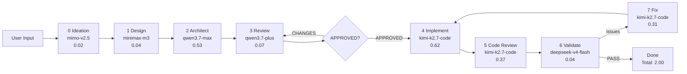

# Pipeline Diagrams — Complete Reference

## Diagram Files

| File | Format | Description |
|------|--------|-------------|
| `pipeline-simple.d2` | D2 | Simplified flow with models + costs |
| `pipeline-simple.svg` | SVG | Rendered output |
| `pipeline-consolidated.d2` | D2 | Detailed flow with all components |
| `pipeline-consolidated.svg` | SVG | Rendered output |
| `pipeline.ofk` | OpenFlowKit | Interactive diagram (for OpenFlowKit app) |
| `pipeline-flow.png` | Python | Cloud infra style |
| `pipeline-architecture.md` | Mermaid | Inline documentation |

---

## D2 Diagram (Recommended)

### View in VS Code
1. Install "D2" extension
2. Open `pipeline-simple.d2`
3. Preview renders automatically

### Render to SVG
```bash
d2 --layout elk docs/pipeline-simple.d2 docs/pipeline-simple.svg
```

### What's Shown

**Stages with Models & Costs:**
| Stage | Model | Cost/Run |
|-------|-------|----------|
| 0 Ideation | mimo-v2.5 | 0.02 |
| 1 Design | minimax-m3 | 0.04 |
| 2 Architect | qwen3.7-max | 0.53 |
| 3 Review | qwen3.7-plus | 0.07 |
| 4 Implement | kimi-k2.7-code | 0.62 |
| 5 Code Review | kimi-k2.7-code | 0.37 |
| 6 Validate | deepseek-v4-flash | 0.04 |
| 7 Fix | kimi-k2.7-code | 0.31 |
| **Total** | | **~2.00** |

**Artifacts:**
- product-plan.md (Stage 0 output)
- requirements.md + design.md (Stage 1 output)
- architecture.md + architecture.d2 (Stage 2 output)
- review.md (Stage 3 output)
- src/ (Stage 4 output)
- code-review.md (Stage 5 output)
- issues.md (Stage 6 output)

**Recovery Components:**
- Checkpoints (save after each agent)
- Dead Letter Queue (failed tasks)
- Circuit Breakers (5 failures = OPEN)

**Model Tiers:**
- Recommended: 2.00/run
- Cheap: 0.47/run
- Hybrid: 0.90/run
- ZenFree: 0

---

## OpenFlowKit Diagram

### View in OpenFlowKit App
1. Go to https://openflowkit.app
2. Click **Import** or paste DSL
3. Diagram renders with icons + animations

### OpenFlowKit DSL

```dsl
flow: Multi-Agent Multi-Project Pipeline
direction: LR

[start] user: User Input { icon: "User", color: "blue" }
[process] ideation: "Stage 0: Ideation\nModel: mimo-v2.5\nCost: ~0.02" { icon: "Lightbulb", color: "violet" }
[process] summary: "Summary & Confirm\n(text or file input)" { icon: "FileText", color: "violet" }
[process] agent-meeting: "Agent Meeting\n(all 7 agents query)" { icon: "Users", color: "violet" }
[process] optional: "Optional Reqs\n(nice-to-have)" { icon: "PlusCircle", color: "violet" }
[process] design: "Stage 1: Design\nModel: minimax-m3\nCost: ~0.04" { icon: "Palette", color: "teal" }
[process] architect: "Stage 2: Architect\nModel: qwen3.7-max\nCost: ~0.53" { icon: "Building", color: "teal" }
[process] review: "Stage 3: Review\nModel: qwen3.7-plus\nCost: ~0.07" { icon: "CheckCircle", color: "amber" }
[decision] gate: "APPROVED?\n(gate before code)" { color: "emerald" }
[process] implement: "Stage 4: Implement\nModel: kimi-k2.7-code\nCost: ~0.62" { icon: "Code", color: "orange" }
[process] code-review: "Stage 5: Code Review\nModel: kimi-k2.7-code\nCost: ~0.37" { icon: "Search", color: "purple" }
[process] validate: "Stage 6: Validate\nModel: deepseek-v4-flash\nCost: ~0.04" { icon: "Bug", color: "purple" }
[process] fix: "Stage 7: Fix\nModel: kimi-k2.7-code\nCost: ~0.31" { icon: "Wrench", color: "red" }
[end] done: "Done\nTotal: ~2.00/run" { icon: "Check", color: "emerald" }

user ==> ideation
ideation ==> summary
summary ==> agent-meeting
agent-meeting ==> optional
optional ==> design
design ==> architect
architect ==> review
review -> gate
gate ->|APPROVED| implement
gate ->|CHANGES| review
implement ==> code-review
code-review ==> validate
validate ->|issues| fix
fix ==> implement
validate ->|PASS| done
```

---

## Mermaid Diagram (GitHub/VS Code inline)



---

## Quick Reference

### Model Tier Costs

| Tier | Cost/Run | Best For |
|------|----------|----------|
| Recommended | 2.00 | Full quality |
| Cheap | 0.47 | Budget |
| Hybrid | 0.90 | Balance |
| ZenFree | 0 | Testing |

### Key Gates

| Gate | Rule |
|------|------|
| Implement | review.md MUST contain APPROVED |
| Validate | Runs real tests, writes issues.md |
| Fix Loop | fix -> validate -> repeat until issues.md empty |
| Circuit Breaker | 5+ failures = OPEN |

### Commands

```bash
# Render D2
d2 --layout elk docs/pipeline-simple.d2 docs/pipeline-simple.svg

# Render Python diagrams
python scripts/generate_diagrams.py

# OpenFlowKit (via MCP or app)
# Paste DSL at https://openflowkit.app
```
