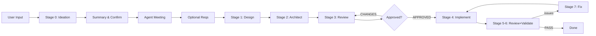

# OpenFlowKit Pipeline Diagram

## How to View

1. Go to **https://openflowkit.app**
2. Click **Import** or paste the DSL below
3. The diagram will render automatically

## OpenFlow DSL

```dsl
flow: Multi-Agent Multi-Project Pipeline
direction: LR

[start] user: User Input { icon: "User", color: "blue" }
[process] ideation: Stage 0 Ideation { icon: "Lightbulb", color: "violet" }
[process] summary: Summary & Confirm { icon: "FileText", color: "violet" }
[process] agent-meeting: Agent Meeting { icon: "Users", color: "violet" }
[process] optional: Optional Reqs { icon: "PlusCircle", color: "violet" }
[process] design: Stage 1 Design { icon: "Palette", color: "teal" }
[process] architect: Stage 2 Architect { icon: "Building", color: "teal" }
[process] review: Stage 3 Review { icon: "CheckCircle", color: "amber" }
[decision] gate: Approved? { color: "emerald" }
[process] implement: Stage 4 Implement { icon: "Code", color: "orange" }
[process] validate: Stage 5-6 Review+Validate { icon: "Bug", color: "purple" }
[process] fix: Stage 7 Fix { icon: "Wrench", color: "red" }
[end] done: Done { icon: "Check", color: "emerald" }

user ==> ideation
ideation ==> summary
summary ==> agent-meeting
agent-meeting ==> optional
optional ==> design
design ==> architect
architect ==> review
review -> gate
gate ->|APPROVED| implement
gate ->|CHANGES| review
implement ==> validate
validate ->|issues| fix
fix ==> implement
validate ->|PASS| done
```

## Alternative: Mermaid Version

If you prefer Mermaid (renders in GitHub/VS Code):



## Files

| File | Description |
|------|-------------|
| `docs/pipeline.ofk` | OpenFlowKit DSL source |
| `docs/pipeline-simple.d2` | D2 simplified flow |
| `docs/pipeline-consolidated.d2` | D2 detailed flow |
