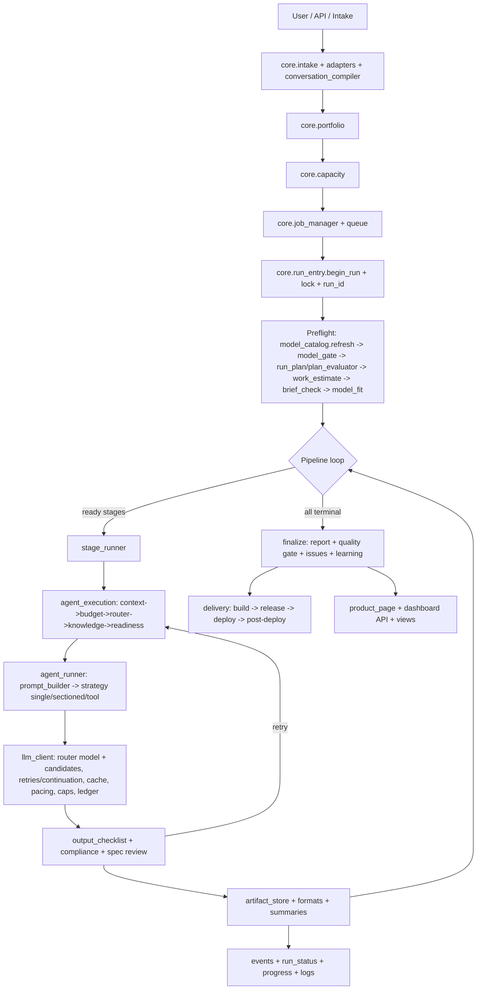
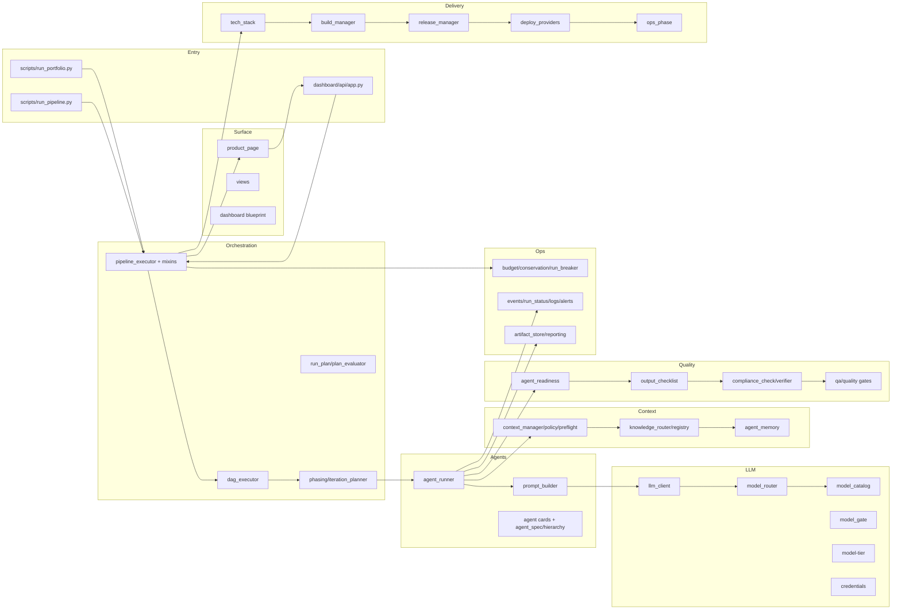
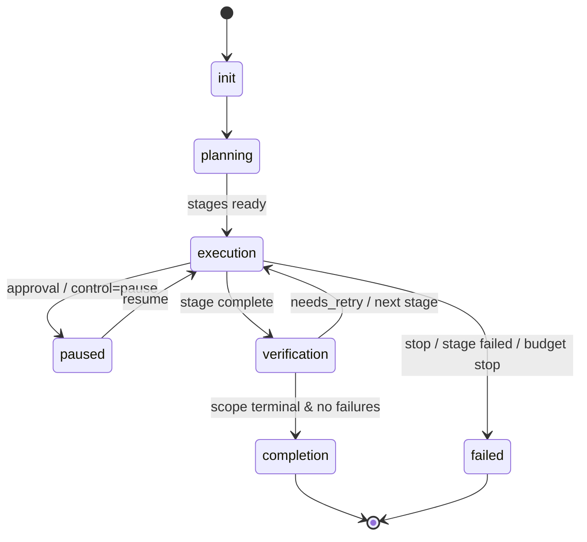

# Product Forge — Full Architecture & Design (E2E)

> End-to-end architecture of Product Forge: initiation → intake → portfolio → jobs →
> run lifecycle → stages/phases → agents → LLM management → context/knowledge →
> budgets → checklists/compliance → artifacts → observability → delivery → dashboard,
> plus the item backlog (open/closed) and a component + flow diagram.
> Code truth lives in `core/` (216 modules) + `core/orchestrator/` mixins; config in
> `config/` (29 files); API in `dashboard/api/app.py`; entry in `scripts/run_pipeline.py`.

---

## 0. Philosophy & governance
- **`Code = SOP(Team)`** vibe (MetaGPT): a software company encoded as roles + artifacts + gates.
- **Product, not prototype**: full quality gates (compliance, spec review, build/version, boot + category tests, coverage, Go/No-Go, RCCA).
- **One truth per concern, one writer per file** — enforced by `config/store-registry.json` + `scripts/dev/wired_audit.py`.
- **Work items live in the backlog** (`core/backlog.py`), never a new file.
- **Derived files are generated**, never hand-edited.
- **Paths SSOT** `core/paths.py`; nothing re-derives ROOT.
- **Config-driven** (no hardcoded thresholds) — `config/*.json`, `core/agent_requirements.py`.

## 1. Tiers & scopes
| Scope | Meaning | Key modules |
|---|---|---|
| **GLOBAL** | Portfolio of many projects | `core/portfolio.py`, `core/capacity.py`, `core/global_orchestrator.py` |
| **PROJECT** | One product pipeline | `core/pipeline_executor.py` (+ mixins) |
| **PRODUCT_FORGE** | Forge improving itself | `core/forge_store.py`, `products/ProductForge-Dashboard/` |
| **Platform** | tenancy/billing/licensing | `core/tenancy.py`, `core/billing.py`, `core/licensing.py` |

## 2. Entry points & intake
- **CLI entry**: `scripts/run_pipeline.py` (`new|continue|enhance`, `--tier`, `--from-stage`, `--only-stage`, `--agent`, `--phase`, `--auto`, `--interactive`, `--step`, `--idea`, `--project`, `--fresh`). CLI helpers `scripts/pipeline.py`, `scripts/run_portfolio.py`.
- **HTTP/API**: `dashboard/api/app.py` (FastAPI, ~90 routes; see §18).
- **Intake funnel**: `core/intake.py`, `core/intake_adapters.py`, `core/intake_channels.py`, `core/intake_files.py`, `core/conversation_compiler.py`, `core/conversation_models.py`, `core/intent_router.py`, `core/intake_api.py`, `core/websocket_manager.py`.
- **Any-file intake**: `core/intake_files.py` stores an uploaded original verbatim (`products/intake/_files/<source>/`) and extracts text (`.pdf` via pypdf, `.docx` via python-docx, legacy `.doc` best-effort, `.rtf`, all text-like formats; images stored, no OCR), then feeds it through the same funnel; stored paths are linked on the item (`links.files`).
- **Adopt external project**: `core/adopt_project.py`; **enhance mode**: `core/enhance.py`.

## 3. Portfolio & capacity
- `core/portfolio.py` — register/supervise many projects; `core/capacity.py` — max parallel slots (`config/capacity.json`); `core/global_orchestrator.py` — global supervision; `core/run_guard.py` — single instance per project.

## 4. Job manager & queue
- `core/job_manager.py` (queued/running/paused/completed; `enqueue`, `finish`, `pause_request`, `run_now_on_priority`), `core/queue_manager.py`, `core/run_breaker.py`, `core/dead_letter_queue.py`, `core/circuit_breaker.py`.
- `scripts/run_portfolio.py` drives the global queue; job state in SQLite (`core/control_plane.py`).

## 5. Run lifecycle (start → finish)
1. **Lock & run entry**: `core/run_entry.begin_run` → `core/lock_manager` (dead-PID reclaim) → run id; `core/run_state.reconcile` (preserve-first resume).
2. **Preflight (in `execute_pipeline`, `core/pipeline_executor.py`)**:
   - `core/model_catalog.refresh_if_stale` (all providers, `last_refreshed`)
   - `core/model_gate` (capability fit, recommend/block)
   - `core/run_plan.ensure_plan` → `core/plan_evaluator` (optional-stage/agent plan; deferred until discovery)
   - `core/work_estimate.estimate_all` (per-agent calls/time)
   - `core/brief_check.assess` (unclear brief → `core/alerts.ask_and_wait` + email, else block)
   - `core/model_fit` live probe (skipped when gate healthy)
3. **Loop**: `_check_time_budget` → conservation → `dag_executor.get_ready_stages` → parallel or sequential stages → checkpoint.
4. **Finish**: finalize (COMPLETE only if scope terminal & no failures) → final report → journal/status → quality gate → issues → cross-project learning.
5. **Resume/selective**: `_restore_from_checkpoint` rehydrates disk artifacts; `invalidate_for_rerun` resets scope; `core/rerun_review` presents recommendations.

## 6. Dynamic pipeline (definition → tailored run)
- **Definition**: `pipeline-definition.json` (39 stages, 8 phases P1..P8; `optional=True` on 0b–0e, 13/13a/13b).
- **DAG**: `core/dag_executor.py` (COMPLETED/SKIPPED satisfy deps).
- **Phases/iterations**: `core/iteration_planner.py`, `core/phasing.py`, `core/forced_convergence.py`.
- **Tailoring/templates**: `core/pipeline_tailoring.py`, `core/pipeline_templates.py` (`config/*`, `/api/v1/pipeline/tailoring`).
- **Run plan**: `core/run_plan.py` + `core/plan_evaluator.py` + `config/plan-groups.json` (grouped optional capabilities; prerequisite closure; dependency warnings; user confirm; `run-plan.json`).

## 7. Stage execution — `core/orchestrator/stage_runner.py`
Banner → integrations (`core/integration_advisor`) → extended capabilities (`core/pipeline_capabilities`, `core/capability_bridge`) → target select (`core/target_selector`) → design augmentations → capability hooks → dashboard blueprint → VCS (`core/vcs`) → stop conditions → budget → **agent loop** → compliance retries → totals → `mark_completed/failed` → stage duration → stage checkpoints → final report → events → tracking → VCS finalize.

## 8. Agent execution & prompt pipeline
- **`core/orchestrator/agent_execution.py`**: circuit breaker → conservation → context package (`core/context_manager`) → budget → model routing (`model_router`) → knowledge routing → reasoning → audit → **readiness checklist** → generation → LLM retry → audit/tokens → artifact store.
- **`core/orchestrator/agent_runner.py`** (generation): artifact path → input cache → `_build_agent_prompt` → strategy (single/sectioned/per-feature/tool-loop) → usable/truncated checks → write artifact (+per-feature +formats) → cache-good-output → summary; `_generate_with_tools` (tool loop), `_generate_sectioned` (per-section/feature).
- **Prompt assembly** (`prompt_builder.py`): card instructions → tool directive → output requirements (incl. required headings) → scope guard → **no-invention guard** → conciseness/infra/research guards → test/techstack/business/service/code-analyzer directives → no-tools warning → owner overlay → amend → `instruction + CONTEXT + "write output to"` → knowledge block.
- **Cards**: `.opencode/agent/<id>.md` (61); `core/agent_card_loader.py`, `core/agent_spec.py`, `core/agent_hierarchy.py`.

## 9. LLM management
- **Registry/catalog**: `core/model_catalog.py` (`config/model-catalog.json`; tools/reasoning/structured_outputs/context/max_output/modalities/pricing/`last_refreshed`/`retired`), `core/model_registry.py`, `core/model_recommendation.py`, `core/tier_builder.py`.
- **Router**: `core/orchestrator/model_router.py` (tier profile → agent model + candidates across providers; overrides; inheritance).
- **Tiers**: `config/model-tier.json` (profiles: `actual`, `free-trial`, `actual-balanced`, `free-trial-fast`, `kctier`); allocation via `scripts/dev/build_tier_allocation.py`; validation `scripts/dev/check_tier_models.py`.
- **Gate/fit**: `core/model_gate.py` (OK/UNKNOWN/INCOMPATIBLE + recommend), `core/model_fit.py` (live probe, recommend-only).
- **Client**: `core/orchestrator/llm_client.py` — request build, retries (2), **429 backoff**, continuation (3/6), chunking/map-reduce, caching (output/semantic), **pacing**, **per-call wall cap 600s**, **per-agent budget 900s**, token accounting, **call ledger**.
- **Credentials**: `core/credentials.py` + `config/provider-keys.json` (env-var names only); `core/orchestrator/llm_client._get_api_key`; provider headers incl. `x-opencode-session`.

## 10. Context, knowledge, skills, memory
- **Context**: `core/context_manager.py` (contracts), `core/context_policy.py` (FULL vs SUMMARY), `core/context_preflight.py` (window check), `core/context_engine.py`, `core/orchestrator/artifacts_map.py`, compaction in `llm_client`.
- **Knowledge/skills**: `core/knowledge_registry.py`, `core/knowledge_router.py`, `core/skills_registry.py`, `core/business_models_kb.py`, `core/business_skills_selector.py`, `config/agent-capabilities.json`, `config/knowledge-registry.json`, `core/knowledge_compiler.py`, `core/knowledge_refresh.py`.
- **Memory/learning**: `core/agent_memory.py`, `core/memory_api.py`, `core/cross_project_learning.py`, `core/insights.py`.

## 11. Budget & cost
`core/budget.py` (single-writer facade), `core/budget_protection.py`, `core/budget_allocator.py`, `core/budget_conservation.py` (graceful degradation/skip), `core/budget_tracker.py`, `core/run_breaker.py` (hard wall + throttle), `core/cost_kpi.py`, `core/finops.py`, `products/<p>/budget.json`, `core/call_ledger.py` (per-call tokens).

## 12. Checklists & compliance
- **Pre-run**: brief sufficiency (`core/brief_check.py`), model gate, run plan, estimate.
- **Pre-agent readiness**: `core/agent_readiness.py` (DAG-derived inputs, context size, model assigned, provider key) → block/warn + `readiness.json` + events + email.
- **Output**: `core/output_checklist.py` (required sections incl. `config/agent-requirements.json`; FR/NFR/US id integrity = advisory) + `core/compliance_check.py` + `core/orchestrator/compliance.py` + `core/compliance_verifier.py` (LLM-as-verifier) + `core/compliance_action_handler.py` + `core/knowledge_compliance_checker.py`.
- **Gates**: `core/spec_review.py`, `core/qa_report.py` (Go/No-Go), `core/qir.py`, `core/code_quality_gate.py`, `core/run_quality_gate.py`, `core/pr_gate.py`.

## 13. Artifacts & storage
`core/artifact_store.py`, `core/artifact_registry.py`, `core/stage_paths.py`, `core/artifact_formats.py`, `core/diagram_render.py`, `core/architecture_diagram.py`, `core/pdf_generator.py`, `core/agent_summaries.py`, `core/orchestrator/reporting.py`, `core/orchestrator/checkpoint.py`.

## 14. Observability & logging
`core/events.py` (lifecycle taxonomy), `core/run_status.py` (single writer), `core/progress.py` (banner incl. `(+N skipped)`), `core/agent_ledger.py`, `core/orchestrator/storage.AgentAuditLog`, `core/log_router.py` + `config/log-conventions.json`, `core/logging_manager.py`, `core/notification_system.py`, `core/alerts.py` (email + ask-and-wait), `core/views.py`, `core/pipeline_telemetry.py`, `core/websocket_manager.py`, `core/audit_trail.py`.

## 15. Delivery & ops
`core/tech_stack.py`, `core/architecture_diagram.py`, `core/sizing.py`, `core/target_advisor.py`, `core/build_manager.py`, `core/build_utility.py`, `core/release_manager.py`, `core/version_manager.py`, `core/deploy_providers.py`, `core/docker_compose_generator.py`, `core/git_manager.py`/`core/vcs.py`, `core/ops_phase.py`, `core/maintenance.py`, `core/signing.py`.

## 16. QA & verification
`core/nfr_runner.py`, `core/nfr_coverage.py`, `core/verification_runner.py`, `core/verification_policy.py`, `core/test_framework_bridge.py`, `core/test_framework_integration.py`, `core/test_matrix.py`, `core/qa_cycles.py`, `core/qa_manifest.py`, `core/qa_intelligence.py`, `core/multi_model_review.py`, `core/visual_qa.py`, `core/mobile_tester.py`, `core/defect_loop.py`, `core/issue_tracker.py`.

## 17. Product page, dashboard & APIs
- **Read model**: `core/product_page.py` (`page/identity/progress/features/artifacts/quality/cost/bom/releases/activity`), `core/dashboard_blueprint.py`, `core/dashboard_archetypes.py`, `core/project_journal.py`, `core/progress.py`.
- **API (FastAPI, `dashboard/api/app.py`)** groups:
  - Health/status: `/health`, `/api/v1/health`, `/api/v1/status`, `/metrics`, `/api/v1/instance`
  - Runs/planning: `/api/v1/run-plan`, `/api/v1/run-status`, `/api/v1/work-estimate`, `/api/v1/call-ledger`, `/api/v1/capacity`, `/api/v1/events`
  - Models: `/api/v1/model-fit`, `/api/v1/model-gate`, `/api/v1/model-catalog`, `/api/v1/readiness`
  - Pipeline/agents: `/api/v1/pipeline/stages`, `/api/v1/pipeline/agents`, `/api/v1/pipeline/agents/{agent}`, `/api/v1/pipeline/tailoring/{project}`, `/api/v1/pipeline/templates`, `/api/v1/capabilities`, `/api/v1/agents`, `/api/v1/agents/templates`, `/api/v1/agents/{agent}/control`, `/api/v1/blueprint`
  - Products: `/api/v1/products/{project}/page|progress|features|artifacts|quality|cost|bom|releases|activity`
  - Compliance/quality: `/api/v1/compliance`
  - Backlog/intake: `/api/v1/backlog*`, `/api/v1/intake*`, `/api/intake`, `/api/v1/intake/file` (multipart), `/api/v1/intake/file-base64` (JSON for CustomGPT)
  - Rerun/reviews: `/api/v1/projects/{project}/rerun-review`, `/api/v1/projects/{project}/reviews`
  - Admin/tenancy/billing/licensing: `/api/v1/tenants/*`, `/api/v1/cp/*`, `/api/v1/billing/checkout`, `/api/v1/licensing/*`, `/api/v1/projects/archived|archive|restore|purge-due`, `/api/v1/memory`, `/api/v1/projects/{project}/git`
- **Dashboard plan**: docs `DASHBOARD-E2E-DESIGN.md`, `dashboard/` (api + static + server.py); views generated statically via `core/views.py`.

## 18. Self-hosting concerns
`core/billing.py`, `core/licensing.py` (`config/licensing-tiers.json`), `core/tenancy.py`, `core/byot_integration.py`, `core/agent_migrator.py`, `core/review_ledger.py`, `core/change_registry.py`, `core/adopt_project.py`, `core/enhance.py`.

## 19. Config & stores
- **Config (29)**: `agent-capabilities`, `agent-hierarchy`, `agent-requirements`, `alerts`, `artifact-formats`, `artifact-paths`, `business-models-kb`, `capacity`, `context-policy`, `dashboard-blueprint`, `discovery-panel-settings`, `env-flags`, `file-manifest`, `intake-channels`, `knowledge-registry`, `legacy-frozen`, `licensing-tiers`, `log-conventions`, `model-catalog`, `model-tier`, `persona`, `plan-groups`, `provider-keys`, `qa-weights`, `spec-id-families`, `store-registry`, `techstack-catalog`, `test-matrix`, `verification-policy`.
- **Per-project stores**: `project.json`, `pipeline-state.json`, `controls`, `events.jsonl`, `run-status.json`, `readiness.json`, `model-gate.json`, `run-plan.json`, `plan-review.json`, `work-estimate.json`, `call-ledger.jsonl`, `budget.json`, `issues/`, `artifacts/`, `compliance/`, `backlog/`, `memory/`, `logs/<run_id>/`.

## 20. Backlog (open / closed)
- **Id scheme**: new items are `BI-<TAG>-<nnn>` where TAG encodes the destination — `PF` (Product Forge backend/pipeline), `DASH` (ProductForge-Dashboard), `IN` (raw intake idea), `<PROJECT-SLUG>` (project being built / existing project). Legacy `BI-####` ids stay valid and parse identically (`core/backlog.py::tag_for`, tolerant `BI-(?:TAG-)?####` readers).
- **product_forge**: **45 open / 187 closed** (`data/backlog/`). Recent: `BI-0220` epic + `BI-0221..BI-0230` (capability steering, structured+render, parallel sections, context discipline, fallback/escalate, OSS prompt review, verbose logging/loops, incremental writes…); `BI-PF-0231` destination-tagged ids, `BI-PF-0232` any-file intake.
- **ProductForge-Dashboard**: **146 open / 3 closed** (dashboard scope).
- **e2e-smoke 6/0**, **smoke-all 11/0**, **test-project 1/0**.
- API: `/api/v1/backlog`, `/backlog/stats`, `/backlog/parked`, `/backlog/{eid}`.

## 21. Known gaps / roadmap (from the review)
1. Capability steering (reasoning on/off, structured output, tool subset) — BI-0221..0223.
2. Structured-output + deterministic render; parallel sections; context discipline — BI-0224..0226.
3. Capability fallback + escalate-on-failure — BI-0227.
4. OSS role-prompt standardization — BI-0228.
5. Verbose-gated logging + loops/tool-calls in summary — BI-0229.
6. Incremental artifact writes — BI-0230.
7. Completions: run_status for all stage events; parallel human-wait; audit single-writer.

---

## 22. Diagrams

### 22.1 End-to-end flow


### 22.2 Component map


### 22.3 Run/verify lifecycle states


---

### Notes
- **Logging**: per-call `[LLM]`, `[HEARTBEAT]` (>2 min, every 60 s), `[Estimate]`, per-agent `Model/Started/Ended/Duration/Artifacts/Calls`, `call-ledger.jsonl`, `events.jsonl`, `run-status.json`, `logs/<run_id>/<stage>-<agent>.log`.
- **Verbosity**: to be made flag-based (`PIPELINE_VERBOSE`/`logLevel`) — on now, minimal later (BI-0229).
- This document is descriptive, generated from the live code/config; regenerate after structural changes.


---

## Appendix A — Folder structure

```
.backups/
.env.example
.opencode/
.pytest_cache/
AGENTS.md
LICENSE
MANIFEST.in
README.md
THIRD_PARTY_LICENSES
adapters/
agents/
approve.py
archive/
byot/
config/                 # 29 JSON config/stores
core/                   # 215 modules + orchestrator/ (16 mixins)
dashboard/
data/
docs/
generate_pdf.py
install.bat
install.py
install.sh
install_complete.py
install_guide.py
opencode.json
pipeline/
pipeline-definition.json
pipeline_templates/
products/               # one dir per project (artifacts, state, backlog, logs, plans)
pyproject.toml
scripts/
security/
setup.py
templates/
test-framework/
test_product/
tests/
videos/
```

### Folder roles

- **`core/`** — The engine: 216 modules — orchestration, agents, LLM, context, budget, compliance, artifacts, delivery, QA, dashboards, self-hosting.
- **`core/orchestrator/`** — 16 extracted mixins: pipeline pieces (agent_runner, agent_execution, stage_runner, llm_client, model_router, prompt_builder, compliance, phasing, checkpoint, reporting, types, storage…).
- **`config/`** — 29 JSON config/stores (tiers, catalog, provider-keys, agent-requirements, plan-groups, alerts, store-registry, env-flags, context-policy…).
- **`dashboard/`** — FastAPI backend (`api/app.py`, ~90 routes) + static UI + `server.py`.
- **`scripts/`** — Entry points (`run_pipeline.py`, `run_portfolio.py`) + `dev/` checks/tools.
- **`.opencode/`** — Agent cards (`agent/*.md`, 61), commands, skills, `.opencode.key` (Account key).
- **`docs/`** — Architecture + design + reference docs (this file lives here).
- **`products/`** — Per-project runtime: `artifacts/`, `pipeline-state.json`, `events.jsonl`, `run-status.json`, `readiness.json`, `model-gate.json`, `run-plan.json`, `work-estimate.json`, `call-ledger.jsonl`, `budget.json`, `backlog/`, `logs/<run>/`.
- **`data/`** — Product Forge's own backlog (`data/backlog/open.json|closed.json`) + pipeline data.
- **`test-framework/`** — QA/e2e catalogues, reports, defect tracker.
- **`pipeline-definition.json`** — The 39-stage DAG + 8 phases (root).

## Appendix B — Core modules (brief)

### core/ (216)

- **`adopt_project.py`** — Adopt a project built OUTSIDE the pipeline — scan it, then manage it E2E under Product Forge.
- **`agent_card_loader.py`** — Agent Card Loader/Validator
- **`agent_hierarchy.py`** — Agent hierarchy (parent -> sub-agents) — single source of truth.
- **`agent_ledger.py`** — Agent Ledger - Tracks all agent work, contributions, and outcomes.
- **`agent_memory.py`** — Agent Memory System — Phase G
- **`agent_messenger.py`** — Agent Messenger
- **`agent_migrator.py`** — Migrate old-format agent .md files to new standardized format.
- **`agent_model_override.py`** — Per-agent runtime MODEL OVERRIDE - persisted, project-scoped. Single writer (BI-0178).
- **`agent_readiness.py`** — Agent readiness checklist (PRE-execution).
- **`agent_requirements.py`** — Agent requirements loader (config-driven).
- **`agent_rules.py`** — Parse new-format agent .md files into structured data.
- **`agent_runtime.py`** — Agent Runtime / Harness
- **`agent_spec.py`** — Agent Specification (framework-agnostic)
- **`agent_structure.py`** — Common structure definition for all agent .md files.
- **`agent_summaries.py`** — Per-agent brief summaries — written at AGENT COMPLETION (not gated behind approvals).
- **`agent_tool_loop.py`** — Agent Tool Loop (framework-agnostic)
- **`alerts.py`** — Alerts — out-of-band notification (email) + human ask-and-wait for doubts.
- **`app_smoke.py`** — App boot/import smoke.
- **`architecture_diagram.py`** — Architecture diagram generator (5.5).
- **`artifact_formats.py`** — Dynamic artifact-format policy (BI-0110).
- **`artifact_registry.py`** — Artifact registry (industry-standard build artifact storage).
- **`artifact_store.py`** — Artifact Store - manages artifacts produced by pipeline stages.
- **`audit_trail.py`** — Audit Trail - Tracks all agent actions
- **`backlog.py`** — Backlog — the single work-item registry (one per scope).
- **`backlog_link.py`** — Plan <-> Backlog bridge (B1).
- **`banner.py`** — Consistent banner for the whole orchestrator/pipeline (console + views).
- **`billing.py`** — Billing / self-service checkout (BI-0058, BI-0066).
- **`brief_check.py`** — Brief sufficiency — GENERIC, config-driven, LLM-validated. No hardcoded thresholds.
- **`budget.py`** — Single-writer facade for the budget/cost concern (addresses BI-0002).
- **`budget_allocator.py`** — Token Budget Allocator - Phase 2.4
- **`budget_conservation.py`** — Budget Conservation - Graceful degradation when approaching budget limits.
- **`budget_planner.py`** — Budget Planner & Model-Tier Proposer
- **`budget_protection.py`** — Budget Protection System
- **`budget_tracker.py`** — Budget Tracker
- **`build_manager.py`** — Build manager (devops-owned).
- **`build_utility.py`** — Build Utility - Generates deployable builds after implementation.
- **`business_models_kb.py`** — Business-models knowledge pack (BI-0119) + dynamic knowledge acquisition (BI-0118).
- **`business_skills_selector.py`** — Business Model & Skills Selector
- **`byot_integration.py`** — BYOT (Bring Your Own Tools/Models) Integration Layer
- **`call_ledger.py`** — Call ledger — per-LLM-call and per-tool-call payload accounting.
- **`capability_bridge.py`** — Runtime bridge for previously-orphan modules (BI-0124..0137).
- **`capacity.py`** — Capacity governor (portfolio/global tier).
- **`change_registry.py`** — Change Registry
- **`change_spec.py`** — Change/new-item FUNCTIONAL SPEC generator (BI-0183).
- **`circuit_breaker.py`** — Circuit Breaker - Prevents cascading failures
- **`close_loop.py`** — Close-on-verify loop — auto-close a backlog + intake item once a run is VERIFIED.
- **`code_analyzer.py`** — Product Forge Self-Improvement - Code Analyzer
- **`code_executor.py`** — Product Forge Self-Improvement - Code Executor
- **`code_quality_gate.py`** — Code Quality Gate (no mocks / stubs / placeholders)
- **`compliance_action_handler.py`** — Compliance Action Handler
- **`compliance_check.py`** — Compliance Check System
- **`compliance_verifier.py`** — LLM-as-verifier compliance checker.
- **`context_engine.py`** — Context Engine - Phase 1.7
- **`context_manager.py`** — Context Manager - builds minimum context packages per agent.
- **`context_policy.py`** — Context policy — how much of each upstream artifact an agent receives (FULL vs SUMMARY).
- **`context_preflight.py`** — Context preflight — check `instructions + context` against the model window BEFORE the call.
- **`control_plane.py`** — Dashboard control-plane store (SQLite) - BI-0043.
- **`conversation_compiler.py`** — Conversation & Idea Ingestion - Conversation Compiler
- **`conversation_models.py`** — Conversation & Idea Ingestion - Database Models
- **`cost_kpi.py`** — Cost per Successful Task KPI - Phase 2.7
- **`cost_modeling.py`** — Cost Modeling
- **`credentials.py`** — Credentials + budget caps registry (BI-0207).
- **`cross_project_learning.py`** — Cross-Project Learning - shares insights, patterns, and lessons across projects.
- **`cross_review.py`** — Cross-Agent Review Mechanism
- **`customer_onboarding.py`** — Customer Onboarding
- **`dag_executor.py`** — DAG Executor
- **`dashboard_archetypes.py`** — Dashboard Archetypes - Reusable layout templates for different dashboard types.
- **`dashboard_blueprint.py`** — Dashboard + API blueprint (BI-0092).
- **`dead_letter_queue.py`** — Dead Letter Queue - Captures failed tasks
- **`defect_loop.py`** — Defect -> fix -> RCCA loop.
- **`delegation.py`** — Orchestrator-Routed Delegation (Agent-to-Agent)
- **`deploy_providers.py`** — Deployment providers (gap 8) — pluggable apply/verify/destroy per target.
- **`design_critic.py`** — Design Critic - reviews design artifacts for quality, consistency, and completeness.
- **`design_tokens.py`** — Design Tokens - manages design system tokens for consistent UI across projects.
- **`diagram_render.py`** — Diagram renderer: ```mermaid blocks -> .mmd (+ .svg/.png/.pdf when a renderer exists).
- **`discovery_engine.py`** — Discovery Engine - Multi-perspective ideation for vague user ideas.
- **`discovery_panel.py`** — 360-degree discovery panel — per-agent clarifying questions + recommendations.
- **`docker_compose_generator.py`** — Docker Compose Generator - Generates docker-compose.yml from project-config.json
- **`domain_research.py`** — Domain Research Engine
- **`enhance.py`** — Enhance mode.
- **`env_flags.py`** — Central environment-flag registry — every PIPELINE_*/MODEL_*/etc. switch in one place.
- **`event_bus.py`** — Orchestration event bus + context (BI-0020).
- **`events.py`** — Canonical run-lifecycle event taxonomy — ONE schema emitted by the pipeline backend,
- **`feature_flags.py`** — Feature flags / integration toggles.
- **`finops.py`** — FinOps
- **`forced_convergence.py`** — Forced Convergence - ensures pipeline doesn't loop indefinitely.
- **`forge_constitution.py`** — Product Forge Constitution - defines rules, guardrails, and governance for the AI Product Forge.
- **`forge_store.py`** — Product Forge's own scope store (Step 8): plan + run state.
- **`git_manager.py`** — Git Manager
- **`global_orchestrator.py`** — Global Orchestrator
- **`human_proxy.py`** — Auto mode — Human-like agents (HIL proxy + ideation partner).
- **`id_index.py`** — Canonical, format-independent requirement-id index — ONE query for all consumers.
- **`insights.py`** — Single insights store (Step 7 / U3) + Product Forge promotion (B8).
- **`intake.py`** — Idea/context intake — thin facade over the adapter registry + conversation engine.
- **`intake_adapters.py`** — Intake adapter registry (B2).
- **`intake_api.py`** — Conversation & Idea Ingestion - Intake API
- **`intake_channels.py`** — Intake channels — the funnel's front door.
- **`intake_files.py`** — Any-file intake: store originals (`products/intake/_files/<source>/`) + text extraction (.pdf/.docx/.doc/.rtf/text/images) — single writer (BI-PF-0232).
- **`integration_advisor.py`** — Integration advisor (pipeline intelligence).
- **`intent_router.py`** — Conversation & Idea Ingestion - Intent Router
- **`interactive.py`** — TTY-less prompt bridge — relay the pipeline's runtime prompts to a file channel.
- **`issue_tracker.py`** — Issue Tracker - Structured issue tracking for security, NFR, and test issues.
- **`iteration_planner.py`** — Implementation Iteration Planner
- **`job_manager.py`** — Job Manager — the orchestration layer over the existing portfolio queue.
- **`knowledge_compiler.py`** — Knowledge Compiler
- **`knowledge_compliance_checker.py`** — Knowledge-Based Compliance Checker
- **`knowledge_refresh.py`** — BI-0091 idea consolidation + BI-0140 techstack/knowledge refresh.
- **`knowledge_registry.py`** — Unified Knowledge / Skills Registry — add · modify · view knowledge bases, skills,
- **`knowledge_router.py`** — Knowledge Router - Phase 2.3
- **`licensing.py`** — Licensing & entitlements for Product Forge (backend).
- **`llm_error_handler.py`** — LLM Error Handler - Handles LLM API errors with retry logic
- **`lock_manager.py`** — Lock Manager
- **`log_router.py`** — Canonical log router — the single place that decides WHERE logs live and their names.
- **`logging_manager.py`** — Logging Manager
- **`loop_modes.py`** — Loop Modes - Phase 3.1 & 3.2
- **`main.py`** — Product Forge - Main Entry Point
- **`maintenance.py`** — Maintenance
- **`marketing.py`** — Marketing
- **`memory_api.py`** — Memory Batch/Export API
- **`mobile_tester.py`** — Mobile Tester — Simulator management and mobile test execution.
- **`modality.py`** — Multi-modal support — detect a project's modalities and resolve the right models.
- **`model_catalog.py`** — Model Catalog — real, per-model capability metadata fetched from providers.
- **`model_fit.py`** — Model capability fit — preflight reconcile of tier models with agent requirements.
- **`model_gate.py`** — Model Capability Gate (PRE-run).
- **`model_recommendation.py`** — Model Recommendation Engine
- **`model_registry.py`** — Model Capability Registry - Phase 1.1
- **`multi_model_review.py`** — Multi-model review (4.2).
- **`net_ports.py`** — Network port utilities: detect collisions and pick a free port.
- **`nfr_coverage.py`** — NFR coverage (4.3).
- **`nfr_runner.py`** — NFR / security / packaging runner (4.3-4.6).
- **`notification_system.py`** — Notification System - Notifies humans of important events
- **`ops_phase.py`** — LIVE/OPS phase (BI-0021) — opt-in, post-deploy.
- **`orchestration_context.py`** — Orchestration context + Coordinator routing (BI-0020).
- **`output_checklist.py`** — Generic output checklist (generalizes the architect-only completeness check).
- **`paths.py`** — Single source of truth for repository paths (BI-0204).
- **`pdf_generator.py`** — PDF Generation
- **`persona.py`** — Owner persona — the human the auto-mode Human Proxy emulates.
- **`phase3_advanced.py`** — Advanced Phase 3 Modules - Phases 3.3, 3.4, 3.5, 3.6
- **`pipeline_capabilities.py`** — Extended pipeline capabilities (RUN-WIRED).
- **`pipeline_executor.py`** — Pipeline Execution Engine
- **`pipeline_store.py`** — pipeline.json compatibility layer (BI-0005, option 3: split + retire).
- **`pipeline_tailoring.py`** — Pipeline tailoring (BI-0115): derive a per-project customized pipeline from the
- **`pipeline_telemetry.py`** — Pipeline Telemetry & Cost Reporting
- **`pipeline_templates.py`** — Pipeline template registry (BI-0116): load/validate/select templates and convert to a runnable stage map.
- **`plan_evaluator.py`** — Post-discovery RUN PLAN evaluator.
- **`port_config.py`** — Dynamic Port Configuration
- **`portfolio.py`** — Portfolio manager (GLOBAL tier) — register many projects, supervise their runs.
- **`pr_gate.py`** — PR merge gate.
- **`presentation_generator.py`** — Presentation Generator
- **`product_analyzer.py`** — Product Analyzer
- **`product_design_spec.py`** — Product Design Spec - generates and manages the product design specification.
- **`product_ingestion.py`** — Product Ingestion
- **`product_page.py`** — Product one-stop page read model (BI-0216).
- **`product_plan.py`** — Product Plan
- **`progress.py`** — E2E pipeline progress banner.
- **`project_archive.py`** — Project archive / soft-delete (BI-0071).
- **`project_journal.py`** — Project Journal / Live State
- **`project_store.py`** — Single-writer facade for `project.json` (the project descriptor / truth).
- **`prompt_overlays.py`** — Runtime agent instruction overlays — append/adjust an agent's instructions on the fly.
- **`qa_cycles.py`** — QA-owned suite & cycle definitions.
- **`qa_intelligence.py`** — QA trend intelligence (evidence-based).
- **`qa_manifest.py`** — QA manifest + static console snapshot.
- **`qa_report.py`** — QA Go/No-Go matrix + per-cycle coverage report.
- **`qir.py`** — QIR — Quality Index Report (project-level).
- **`quality_metrics.py`** — Quality Metrics - Track Product Forge performance and quality.
- **`queue_manager.py`** — Queue Manager
- **`reasoning_skills.py`** — Reasoning Skills
- **`release_manager.py`** — Release Manager
- **`requirement_link.py`** — Requirement linking (BI-0016 / U8).
- **`rerun_review.py`** — Rerun review (GENERAL - any restart / stage re-run / agent re-run).
- **`review_ledger.py`** — BI-0096 Review-feedback ledger + BI-0117 dynamic agent creation.
- **`run_breaker.py`** — Run Breaker & Alerts
- **`run_entry.py`** — Guarded run entry — the ONE way a project run is started.
- **`run_guard.py`** — Single-run guard: ensure exactly ONE pipeline instance per project.
- **`run_plan.py`** — Idea-based dynamic RUN PLAN.
- **`run_quality_gate.py`** — Run-mode-aware quality gate (BI-0184).
- **`run_state.py`** — Run linkage + resume reconciliation (preserve-first).
- **`run_status.py`** — Single-writer run status.
- **`schema_validator.py`** — Schema validation for Product Forge pipeline artifacts.
- **`service_catalog.py`** — Tech Stack Config Schema - Configuration for any technology in the stack.
- **`signing.py`** — Signing (GPG) — supports BOTH key sources:
- **`sizing.py`** — Sizing / footprint report.
- **`skill_contracts.py`** — Skill Contracts
- **`skills_registry.py`** — Skills & MCP Registry
- **`spec_review.py`** — QA Spec Review gate (pre-implementation, stage 3a).
- **`squad_manager.py`** — Squad Manager - Dynamic Agent Squad Formation.
- **`stage_paths.py`** — Single source for artifact stage directories + human-readable stage names.
- **`state_machine.py`** — State Machine
- **`status.py`** — Canonical status vocabulary — ONE place for every status string in the pipeline.
- **`stop_conditions.py`** — Stop Conditions and Human Escalation - Phase 1.8
- **`target_advisor.py`** — Target advisor (dynamic deployment/delivery targets).
- **`target_selector.py`** — Deployment target selector + catalog.
- **`tech_stack.py`** — Tech Stack decision + knowledge mapping (framework-agnostic).
- **`techstack_guidelines.py`** — Dynamic Techstack Guidelines Generator
- **`tenancy.py`** — Tenancy: tenant members, teams, roles, seats (BI-0068).
- **`test_adapters.py`** — Test adapters (tech-stack agnostic).
- **`test_framework_bridge.py`** — Test Framework bridge (4.1).
- **`test_framework_integration.py`** — Test Framework integration (wires the external test-framework into the pipeline).
- **`test_matrix.py`** — Test matrix (QA-owned).
- **`tier_builder.py`** — Auto tier creation — recommend / validate agent->model from the model catalog.
- **`tool_cache.py`** — Tool Result Cache - Phase 2.2
- **`tool_policy.py`** — Dynamic tool selection per agent — from role + knowledge + project need, not a fixed card.
- **`tool_registry.py`** — Tool Registry (framework-agnostic)
- **`traceability.py`** — Traceability Matrix
- **`vcs.py`** — VCS manager (orchestrator-owned git automation).
- **`vendor_adapters.py`** — Vendor integration adapters + lab handles.
- **`verification_policy.py`** — Verification policy (8.x).
- **`verification_runner.py`** — Verification Runner (real test/build execution)
- **`version_manager.py`** — Version Manager
- **`video_generation.py`** — Video Generation Engine
- **`views.py`** — Static, centralized HTML views (no dashboard needed): log index + traceability.
- **`visual_qa.py`** — Visual QA - validates visual output quality, layout, and design token compliance.
- **`websocket_manager.py`** — Conversation & Idea Ingestion - WebSocket Server
- **`work_estimate.py`** — Work estimate — predict an agent's call shape and time BEFORE it runs.
- **`workflow_docs.py`** — Product Forge - Workflow Documentation Generator
- **`write_safety.py`** — Write Safety

### core/orchestrator/ (extracted mixins)

- **`agent_execution.py`** — Agent execution mixin (extracted from pipeline_executor - 1A.11).
- **`agent_runner.py`** — Agent runner mixin (extracted from pipeline_executor - 1A.11).
- **`artifacts_map.py`** — Semantic artifact map (re-run impact + context assembly).
- **`checkpoint.py`** — Checkpoint / status documents (extracted from pipeline_executor - 1A.11).
- **`compliance.py`** — Compliance Orchestrator (extracted from pipeline_executor - 1A.11).
- **`delegation_coord.py`** — Delegation coordinator (extracted from pipeline_executor - 1A.11).
- **`feature_tracker.py`** — Feature tracker (extracted for 3.2/3.9).
- **`llm_client.py`** — LLM Client (extracted from pipeline_executor - 1A.11).
- **`model_router.py`** — Model Router (extracted from pipeline_executor - 1A.11).
- **`phasing.py`** — Phasing Manager (extracted from pipeline_executor - 1A.11).
- **`prompt_builder.py`** — Prompt Builder (extracted from pipeline_executor - 1A.11).
- **`reporting.py`** — Reporting (extracted from pipeline_executor - 1A.11).
- **`stage_runner.py`** — Stage runner mixin (extracted from pipeline_executor - 1A.11).
- **`status.py`** — Canonical status + dependency model (standardization).
- **`storage.py`** — Orchestrator support: audit log, LLM response cache, artifact summarizer.
- **`types.py`** — Core orchestration types (extracted from pipeline_executor - 1A.11).

### dashboard/api/ + scripts/


**dashboard/api/**
- `app.py` — FastAPI app for the Product Forge Dashboard (backend API layer).

**scripts/**
- `gen_model_registry.py` — Generate model_registry.json from the mymoney llm-catalog.ts source of truth.
- `gen_pipeline_reference.py` — Generate the pipeline stages & agents reference doc (+ PDF).
- `generate_diagrams.py` — Generate pipeline architecture diagrams using the diagrams library.
- `pipeline.py` — Pipeline Command Helper Script
- `pipeline_helpers.py` — Pipeline Helpers - System-level utilities for the Product Forge pipeline.
- `run_pipeline.py` — Generic pipeline runner — the framework-agnostic entry point.
- `run_portfolio.py` — Portfolio CLI (GLOBAL tier) — manage/supervise multiple project pipelines.

**scripts/dev/**
- `_add_kctier_profile.py` — One-shot helper: add the `kctier` profile to both model-tier.json files.
- `_automarge2.py` — (no docstring)
- `_probe_kctier_models.py` — Probe the three kctier models on opencode-go/zen.
- `_probe_mimo.py` — Probe candidate 'mimo' model ids against the Zen (go + non-go) and OpenRouter
- `_probe_ua.py` — Probe the Zen endpoint with different User-Agent header sets.
- `analyze_agent_cards.py` — (no docstring)
- `answer_prompt.py` — Answer the current pending discovery prompt. Usage: python scripts/dev/answer_prompt.py <mode>
- `audit_dependencies.py` — (no docstring)
- `audit_hardcoding.py` — (no docstring)
- `backfill_item_context.py` — APPEND requirement context to thin OPEN backlog items - never overwrite.
- `build_agent_specs.py` — Build framework-agnostic AgentSpec files from .opencode/agent/*.md cards,
- `build_release.py` — Build-time separation of operator vs customer (tenant) packages (BI-0070).
- `build_tier_allocation.py` — Rebuild a tier's per-agent allocation from LEAD role->model + hierarchy.
- `check_tier_models.py` — Advisory drift check: config/model-tier.json vs the model registry + known agents/stages.
- `compare_agents.py` — (no docstring)
- `debug_implement_tools.py` — (no docstring)
- `e2e_backlog_check.py` — E2E wiring check for the backlog backbone (Step 12).
- `extend_schemas.py` — (no docstring)
- `extract_llm_client.py` — 1A.11 extraction: move LLM-call methods from pipeline_executor into
- `extract_table.py` — (no docstring)
- `find_unused_modules.py` — Find core/ modules that are not imported anywhere in the repo (triage helper).
- `gen_backlog_summary.py` — Generate docs/BACKLOG-SUMMARY.md for both scopes (regenerable).
- `generate_agent_cards.py` — Generate standardized agent cards (.opencode/agent/<id>.md) from AgentSpec files,
- `generate_model_analysis.py` — Generate docs/modelanalysis.md — capability analysis of all models (our registry
- `generate_report.py` — (no docstring)
- `invocation_audit.py` — Invocation audit: is every core module actually REACHABLE from the runtime path?
- `live_status.py` — (no docstring)
- `migrate_agents.py` — Dev CLI: migrate legacy agent .md cards to the standardized AgentSpec format.
- `migrate_backlog.py` — Idempotent backlog migration (Step 12).
- `migrate_backlog_refs.py` — Migration (BI-0082): qualify bare BI-#### cross-scope links.
- `migrate_backlog_storage.py` — Migrate backlog storage: legacy full-array layout -> items/<ID>.json (truth) + derived indexes.
- `migrate_paths.py` — One-shot migration (BI-0204): route every root derivation through core/paths.py.
- `parked_review.py` — Parked-item review prompts (BI-0020 tail).
- `probe_native_tools.py` — (no docstring)
- `run_e2e.py` — (no docstring)
- `service_catalog.py` — Dev CLI: list the service catalog (required/optional) and config questions.
- `show_tiers.py` — (no docstring)
- `test_fallback.py` — (no docstring)
- `test_gates.py` — (no docstring)
- `test_spec_wiring.py` — (no docstring)
- `test_techstack.py` — (no docstring)
- `test_tool_e2e.py` — (no docstring)
- `test_tool_loop.py` — (no docstring)
- `test_w2.py` — (no docstring)
- `test_w5.py` — (no docstring)
- `test_w7.py` — (no docstring)
- `update_dependencies.py` — (no docstring)
- `update_iteration_names_budgets.py` — (no docstring)
- `update_phases.py` — (no docstring)
- `verify_fixes.py` — (no docstring)
- `wired_audit.py` — Wired-audit: is every core module actually invoked on the runtime path?
- `workflow_matrix_check.py` — Workflow combination matrix check.

---

## 23. Tech stack — technologies & purpose

| Layer | Technology | Version | Used for (where) |
|---|---|---|---|
| Language | **Python** | 3.10–3.14 | all of `core/`, `core/orchestrator/`, `scripts/`, `dashboard/api` |
| Packaging | **setuptools / pyproject.toml** | — | install; script entry `productforge = core.main:main` |
| API server | **FastAPI** | >=0.104 | dashboard backend (~90 routes) — `dashboard/api/app.py` |
| ASGI server | **Uvicorn** | >=0.24 | serve the API/dashboard |
| Validation | **Pydantic v2** | >=2.0 | request/response models |
| HTTP client | **requests** (+ `urllib`) | — | LLM/provider REST calls (`llm_client`); catalog fetch (`model_catalog`) |
| Env/config | **python-dotenv** + `config/*.json` | — | `.env` + 29 JSON config/stores |
| Database | **SQLite** (stdlib `sqlite3`) | — | control plane, job manager, memory, intake (`core/control_plane.py`, `job_manager.py`, `agent_memory.py`, `intake_api.py`) |
| Realtime | **Starlette WebSockets** (via FastAPI) | — | live updates / intake (`core/websocket_manager.py`) |
| Concurrency | **threading / ThreadPoolExecutor** | — | parallel stages + parallel section calls |
| LLM providers | **OpenRouter, OpenCode Zen, OpenCode Go, Anthropic, OpenAI, Google Gemini, Groq, NVIDIA, Amazon Bedrock, LM Studio** (OpenAI-compatible REST) | — | model backends chosen per tier (`model-tier.json`, `model_catalog.py`) |
| Model capability data | provider `/models` + `supported_parameters` | — | `config/model-catalog.json` (tools/reasoning/structured_outputs/context/pricing) |
| Tools protocol | **MCP (Model Context Protocol)** servers via `npx` | — | e.g. openflowkit, drawio (configured per project) |
| Tool registry | custom `core/tool_registry.py` (+ cache) | — | agent tool loop (read/write/run/http) |
| Documents/PDF | **WeasyPrint** + **Playwright** (optional) | >=60 / >=1.40 | PDF/doc delivery (`core/pdf_generator.py`) |
| Diagrams | **Mermaid** + Python **diagrams** lib + draw.io MCP | — | `core/diagram_render.py`, `core/architecture_diagram.py`, `scripts/generate_diagrams.py` |
| Dashboard UI | **static HTML/CSS/JS** served by FastAPI | — | `dashboard/static`, `dashboard/server.py` (no build step) |
| Testing | **pytest** (+cov, +asyncio) + custom `test-framework/` + **Playwright** e2e | — | `test-framework/`, generated suites, `verification_runner.py` |
| Lint/format/types | **ruff**, **black**, **mypy** | — | dev quality |
| VCS / CI | **git CLI** + **GitHub Actions** | — | `core/vcs.py`, `core/git_manager.py`, `.github/workflows` |
| Containers/deploy | **Docker** + pluggable providers | — | `core/docker_compose_generator.py`, `core/deploy_providers.py` |
| Secrets | **env-var references** (`config/provider-keys.json`, `{env:VAR}`/`{file:path}`) | — | never store raw secrets |
| Signing | **GPG** | — | `core/signing.py` |
| Platform | cross-platform; developed on **Windows/PowerShell** | — | scripts + runtime |

**Notes:** no external service is required to run a project (models are the only external dependency); the dashboard is a static UI over the FastAPI layer; the whole engine is Python + SQLite + REST.

---

## Appendix C — Document consolidation (superseded docs)

This file (`productforge_full_architecture.md`) is the **current architecture/design SSOT**.
Older docs were **not copied verbatim** here on purpose: they contain **historical implementation
detail** that may be stale. Their *current* architecture/design content is captured in the sections
below. The older files are marked **SUPERSEDED** and kept for history only.

| Old doc | Topic | Now in this file |
|---|---|---|
| `architecture.md` | system architecture (old) | §0–19, Diagram §22 |
| `architecture-pluggable-modular.md` | modularity | §1, §19 |
| `PIPELINE_WORKFLOW.md` / `PIPELINE-WORKFLOW-CORRECTED.md` | pipeline flow (old) | §5–8, §22.1 |
| `PIPELINE-STAGES-REFERENCE.md` / `PIPELINE-PHASES-PROPOSAL.md` | stages/phases | §6 |
| `PIPELINE-TEMPLATE-SPEC.md` | templates/tailoring | §6 |
| `PIPELINE-IMPLEMENTATION-PLAN.md` | build plan (historical) | — (roadmap: §21) |
| `ENTRYPOINTS.md` / `PIPELINE-CODE-TRUTH.md` | entry points/code truth | §2, §5 |
| `ORCHESTRATION.md` | orchestration | §4–8 |
| `PORTFOLIO-ORCHESTRATION-DESIGN.md` | portfolio | §3–4 |
| `DASHBOARD-E2E-DESIGN.md` | dashboard | §17 |
| `MODULE-STATUS.md` / `IMPLEMENTED-FEATURES-WIRING.md` | module status/wiring | Appendix B |
| `DEPLOY-INFRA-ARCHITECTURE.md` / `GIT-CI-CD.md` | delivery/CI | §15 |
| `QA-QUALITY-SYSTEM.md` | QA/quality | §16 |
| `BACKLOG-SUMMARY.md` / `BACKLOG-UNIFICATION-ANALYSIS.md` | backlog | §20 |
| `pipeline-architecture.md` | pipeline (old) | §5–8 |

**Current (not superseded):** `pipeline_review_recommendations.md`, `Agent_llm_process.md`,
`agents_prompts_instructions.md`, `agent_prompt_Comparision.md`, `STRUCTURE-CONTRACT.md`,
`CONSTITUTION.md`, `ADDING-TO-PRODUCT-FORGE.md`. To add current content from an old doc, port it
deliberately into the matching section above, then keep the old file marked superseded.


---

## Appendix D — Documentation SSOT & index

**SSOT:** implementation = code (`core/`, `config/`, `pipeline-definition.json`); architecture/design = this file; agent prompts = `.opencode/agent/*.md`; contracts = `STRUCTURE-CONTRACT.md`/`CONSTITUTION.md`/`AGENT_CONTRACT_STANDARD.md`; backlog = `core/backlog.py` stores. `SUPERSEDED` docs are historical.

Full index: `docs/README.md`.

| Doc | Status | Notes |
|---|---|---|
| `ADDING-TO-PRODUCT-FORGE.md` | SSOT/current | How to add anything (recipes/checklists) |
| `AGENT_CONTRACT_STANDARD.md` | SSOT/current | AgentSpec / contract standard |
| `Agent_llm_process.md` | SSOT/current | REVIEW — agent↔LLM process analysis |
| `CONSTITUTION.md` | SSOT/current | Product Forge constitution (rules/governance) |
| `DASHBOARD-E2E-DESIGN.md` | SSOT/current | Dashboard design |
| `Diagram-Generation-Spec.md` | SSOT/current | Diagram generation spec |
| `ENTRYPOINTS.md` | SSOT/current | Which entry script/API to use |
| `Failure-Recovery-System.md` | SSOT/current | Failure/retry/checkpoint recovery |
| `HOW-TO-START-NEW-PROJECT.md` | SSOT/current | Step-by-step to start a project |
| `PIPELINE-OPERATIONS.md` | SSOT/current | Operations: run modes, control, state, status |
| `RE-RUN-IMPACT-ANALYSIS.md` | SSOT/current | Rerun/impact invalidation model |
| `SCHEMA-GUIDE.md` | SSOT/current | Data/schema reference |
| `SECTIONED-GENERATION-ANALYSIS.md` | SSOT/current | Long-output (sectioned) generation design |
| `STRUCTURE-CONTRACT.md` | SSOT/current | Binding structure/repo contract |
| `agent_prompt_Comparision.md` | SSOT/current | REVIEW — per-agent current vs OSS-recommended |
| `agent_prompt_current_vs_recommended.md` | SSOT/current | REVIEW — per-agent concrete current↔recommendation |
| `agents_prompts_instructions.md` | SSOT/current | REVIEW/MIRROR — all agent cards + prompt assembly |
| `credentials.md` | SSOT/current | Credentials + budget registry (BI-0207) |
| `modelanalysis.md` | SSOT/current | Model capability matrix + tier recommendations |
| `pipeline_review_recommendations.md` | SSOT/current | REVIEW — consolidated findings + recommendations (backlog IDs) |
| `productforge_full_architecture.md` | SSOT/current | ARCHITECTURE & DESIGN SSOT (current) — start here |
| `tools-and-generators.md` | Reference (verify) | unclassified — confirm before relying on it |
| `Agent-LLM-PromptHandling.md` | Design/reference | feature/design detail (verify vs code) |
| `BACKLOG-AND-INTAKE.md` | Design/reference | feature/design detail (verify vs code) |
| `DEVOPS-WORKFLOW-ANALYSIS.md` | Design/reference | feature/design detail (verify vs code) |
| `EXTERNAL-TARGETS-WORKFLOW.md` | Design/reference | feature/design detail (verify vs code) |
| `INTAKE-AND-BACKLOG-DESIGN.md` | Design/reference | feature/design detail (verify vs code) |
| `Multi-Agent-Multi-Project-Unique-Features.md` | Design/reference | feature/design detail (verify vs code) |
| `design.md` | Design/reference | feature/design detail (verify vs code) |
| `model-tier-timing-and-multimodal-flow.md` | Design/reference | feature/design detail (verify vs code) |
| `multimodal_orchestration.md` | Design/reference | feature/design detail (verify vs code) |
| `multimodal_selection_dynamic.md` | Design/reference | feature/design detail (verify vs code) |
| `multimodel_architecture_support.md` | Design/reference | feature/design detail (verify vs code) |
| `product-plan.md` | Design/reference | feature/design detail (verify vs code) |
| `product-portal.md` | Design/reference | feature/design detail (verify vs code) |
| `requirements.md` | Design/reference | feature/design detail (verify vs code) |
| `review.md` | Design/reference | feature/design detail (verify vs code) |
| `token-audit.md` | Design/reference | feature/design detail (verify vs code) |
| `token_context_model.md` | Design/reference | feature/design detail (verify vs code) |
| `PIPELINE-RESUME-ProductForge-Dashboard.md` | Runtime/generated | produced by the pipeline |
| `_knowledge_workflow.md` | Runtime/generated | produced by the pipeline |
| `agent-audit.md` | Runtime/generated | produced by the pipeline |
| `agent-context.md` | Runtime/generated | produced by the pipeline |
| `feature-status.md` | Runtime/generated | produced by the pipeline |
| `huggingface.md` | Runtime/generated | produced by the pipeline |
| `input_needed.md` | Runtime/generated | produced by the pipeline |
| `pipeline-diagrams-reference.md` | Runtime/generated | produced by the pipeline |
| `pipeline-openflowkit.md` | Runtime/generated | produced by the pipeline |
| `pipeline-quick-reference.md` | Runtime/generated | produced by the pipeline |
| `pipeline-state.md` | Runtime/generated | produced by the pipeline |
| `test.md` | Runtime/generated | produced by the pipeline |
| `todo.md` | Runtime/generated | produced by the pipeline |
| `4.13-GAP-TRIAGE.md` | Plan/roadmap (historical) | tracker/proposal; not current architecture |
| `CHANGE-PLAN.md` | Plan/roadmap (historical) | tracker/proposal; not current architecture |
| `NFR-COVERAGE-PLAN.md` | Plan/roadmap (historical) | tracker/proposal; not current architecture |
| `NFR-PIPELINE-STRATEGY.md` | Plan/roadmap (historical) | tracker/proposal; not current architecture |
| `PIPELINE_IMPROVEMENT_PLAN.md` | Plan/roadmap (historical) | tracker/proposal; not current architecture |
| `TRACKING-SSOT-AUDIT.md` | Plan/roadmap (historical) | tracker/proposal; not current architecture |
| `UNWIRED-MODULES-TRIAGE.md` | Plan/roadmap (historical) | tracker/proposal; not current architecture |
| `BACKLOG-SUMMARY.md` | SUPERSEDED (historical) | old/implementation detail; see productforge_full_architecture.md |
| `BACKLOG-UNIFICATION-ANALYSIS.md` | SUPERSEDED (historical) | old/implementation detail; see productforge_full_architecture.md |
| `DEPLOY-INFRA-ARCHITECTURE.md` | SUPERSEDED (historical) | old/implementation detail; see productforge_full_architecture.md |
| `GIT-CI-CD.md` | SUPERSEDED (historical) | old/implementation detail; see productforge_full_architecture.md |
| `IMPLEMENTED-FEATURES-WIRING.md` | SUPERSEDED (historical) | old/implementation detail; see productforge_full_architecture.md |
| `MODULE-STATUS.md` | SUPERSEDED (historical) | old/implementation detail; see productforge_full_architecture.md |
| `ORCHESTRATION.md` | SUPERSEDED (historical) | old/implementation detail; see productforge_full_architecture.md |
| `PIPELINE-CODE-TRUTH.md` | SUPERSEDED (historical) | old/implementation detail; see productforge_full_architecture.md |
| `PIPELINE-IMPLEMENTATION-PLAN.md` | SUPERSEDED (historical) | old/implementation detail; see productforge_full_architecture.md |
| `PIPELINE-PHASES-PROPOSAL.md` | SUPERSEDED (historical) | old/implementation detail; see productforge_full_architecture.md |
| `PIPELINE-STAGES-REFERENCE.md` | SUPERSEDED (historical) | old/implementation detail; see productforge_full_architecture.md |
| `PIPELINE-TEMPLATE-SPEC.md` | SUPERSEDED (historical) | old/implementation detail; see productforge_full_architecture.md |
| `PIPELINE-WORKFLOW-CORRECTED.md` | SUPERSEDED (historical) | old/implementation detail; see productforge_full_architecture.md |
| `PIPELINE_WORKFLOW.md` | SUPERSEDED (historical) | old/implementation detail; see productforge_full_architecture.md |
| `PORTFOLIO-ORCHESTRATION-DESIGN.md` | SUPERSEDED (historical) | old/implementation detail; see productforge_full_architecture.md |
| `QA-QUALITY-SYSTEM.md` | SUPERSEDED (historical) | old/implementation detail; see productforge_full_architecture.md |
| `architecture-pluggable-modular.md` | SUPERSEDED (historical) | old/implementation detail; see productforge_full_architecture.md |
| `architecture.md` | SUPERSEDED (historical) | old/implementation detail; see productforge_full_architecture.md |
| `pipeline-architecture.md` | SUPERSEDED (historical) | old/implementation detail; see productforge_full_architecture.md |
